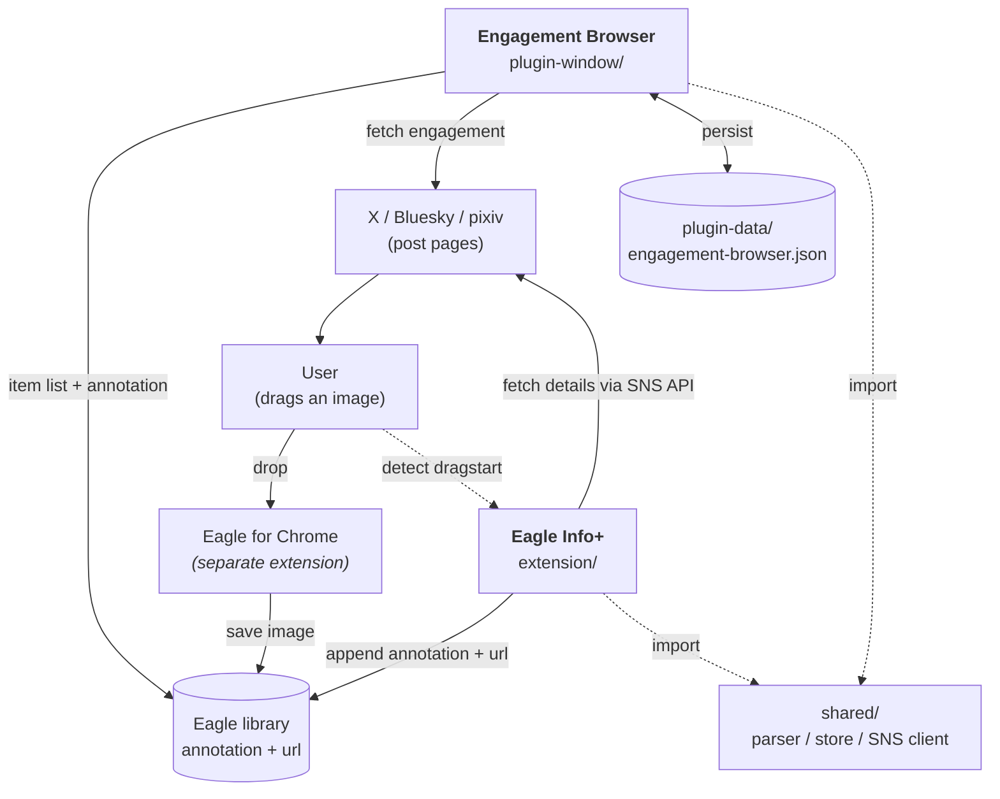

[日本語](README.md) | English

# Eagle Info+

A set of tools that connect an [Eagle](https://en.eagle.cool/) library with social media. A Chrome extension writes the human-readable info of SNS posts into Eagle annotations, and an Eagle Window Plugin lets you filter, sort, and browse your library by engagement (likes, etc.).

## Supported sites

X (Twitter) / Bluesky / pixiv (including R-18 when you are logged in)

## Requirements

- [Eagle](https://en.eagle.cool/) desktop app
- [Eagle for Chrome](https://chromewebstore.google.com/detail/eagle-for-chrome/lieogkinebikhdchceieedcigeafdkid) extension (used to drag-save images)

## Installation

### Chrome extension (Eagle Info+)

1. Clone or download this repository
2. Open `chrome://extensions/` and turn on Developer mode
3. Click "Load unpacked" and select the `extension/` folder

Details: [`extension/README.md`](extension/README.md)

### Eagle Plugin (Engagement Browser)

In Eagle's toolbar → Plugins → Developer options, load `plugin-window/` as a local plugin.

Details: [`plugin-window/README.md`](plugin-window/README.md)

## Disclaimer

An unofficial, personal tool. Not affiliated with the developers of Eagle. "Eagle" and "Eagle for Chrome" are trademarks of their respective owners.

Each SNS API is intended for organizing your own metadata. Do not use it for crawling or bulk fetching.

---

## Architecture

| Directory | Role | Details |
|---|---|---|
| [`extension/`](extension/README.md) | Chrome extension (Eagle Info+) | Writes annotation and url to the Eagle item on drag-save |
| [`plugin-window/`](plugin-window/README.md) | Eagle Window Plugin (Engagement Browser) | Fetch engagement, filter/sort UI |
| `shared/` | Shared modules | Annotation parser, sidecar store, SNS API client. Imported by both the Chrome extension and the Eagle Plugin |

They are most useful together (the Window Plugin builds on the annotations the Chrome extension writes), but the Chrome extension alone is still useful for annotation-based search.
