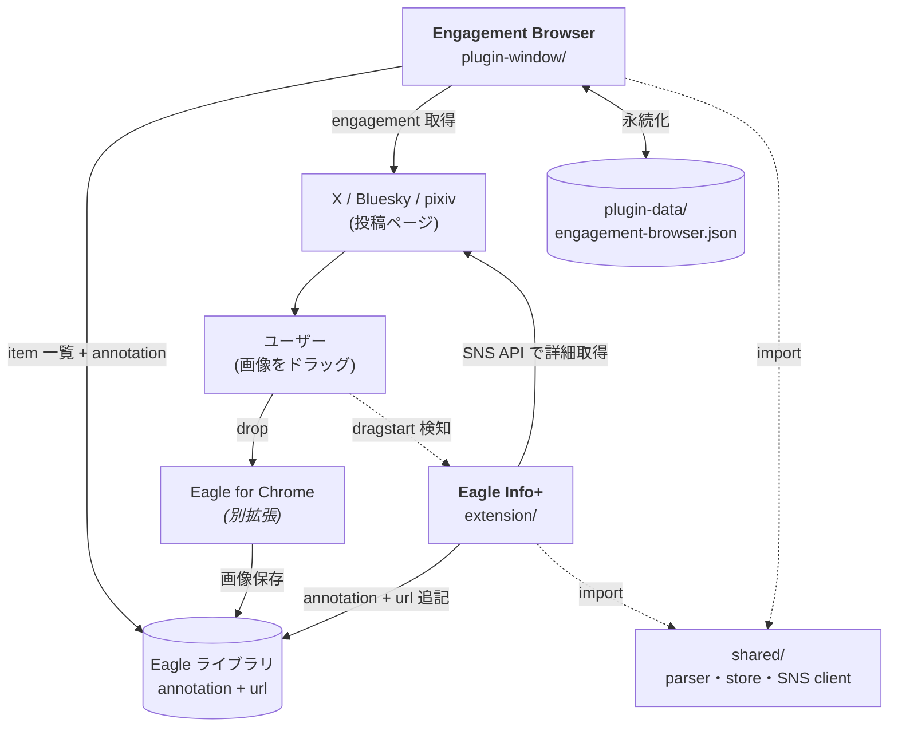

日本語 | [English](README.en.md)

# Eagle Info+

[Eagle](https://jp.eagle.cool/) ライブラリと SNS をつなぐツール群。Chrome 拡張で SNS 投稿の人間情報を Eagle annotation に書き、Eagle Window Plugin で engagement (likes 等) をフィルタ・ソートして閲覧できる。

## 対応サイト

X (Twitter) / Bluesky / pixiv (ログイン中なら R-18 も)

## 必要なもの

- [Eagle](https://jp.eagle.cool/) デスクトップアプリ
- [Eagle for Chrome](https://chromewebstore.google.com/detail/eagle-for-chrome/lieogkinebikhdchceieedcigeafdkid) 拡張 (画像のドラッグ保存に使う)

## インストール

### Chrome 拡張 (Eagle Info+)

1. このリポジトリを clone またはダウンロード
2. `chrome://extensions/` を開いてデベロッパーモードを ON
3. 「パッケージ化されていない拡張機能を読み込む」で `extension/` フォルダを選択

詳細: [`extension/README.md`](extension/README.md)

### Eagle Plugin (Engagement Browser)

Eagle のツールバー → プラグイン → 開発者オプション からローカルプラグインとして `plugin-window/` を読み込む。

詳細: [`plugin-window/README.md`](plugin-window/README.md)

## 免責

非公式の個人製ツール。Eagle の開発元とは無関係。「Eagle」「Eagle for Chrome」は各権利者の商標です。

各 SNS の API は個人のメタデータ整理用途を想定。クロール用途や大量取得には使わない。

---

## 構成

| ディレクトリ | 役割 | 詳細 |
|---|---|---|
| [`extension/`](extension/README.md) | Chrome 拡張 (Eagle Info+) | ドラッグ保存時に annotation と url を Eagle item に書く |
| [`plugin-window/`](plugin-window/README.md) | Eagle Window Plugin (Engagement Browser) | engagement 取得・フィルタ・ソート UI |
| `shared/` | 共通モジュール | annotation parser、サイドカー store、SNS API client。Chrome 拡張と Eagle Plugin の両方が import |

両方使わないと意味が薄い (Chrome 拡張が書いた annotation を Window Plugin が起点にする) が、Chrome 拡張だけでも annotation 検索の用途では機能する。
