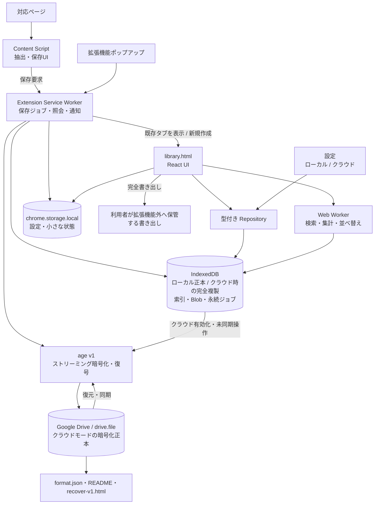

# Hologram Chrome 拡張機能単一構成 移行計画

調査基準日: 2026-08-29

## 文書の位置付け

この文書は、Chrome タブ版の構想と Hologram の YAGNI 判断を統合した実装計画です。対象は Hologram だけです。Sift の YAGNI 判断は別文書で管理します。

移行先の大枠は判断済みです。実装完了を示す文書ではありません。既存コード、作業ツリー、GitHub Issue を 2026-08-29 に再確認した結果を基準に、方針、実装、検証、Issue 操作を分けて記録します。

目標は、Electron アプリ、Native Messaging Host、SQLite、ライブラリフォルダを、Chrome 拡張機能の通常タブ、Service Worker、Web Worker、IndexedDB、`chrome.storage.local`、任意の Google Drive API 連携へ置き換えることです。localhost バックエンドや常駐プロセスは設けません。

初回は IndexedDB を正本とするローカルモードで開始します。Google アカウント、OAuth、回復キーがなくても、保存、閲覧、検索、整理、書き出しを利用できます。設定からクラウド保存を有効にした場合だけ、ローカルライブラリをクライアント側で暗号化して Google Drive の通常フォルダへ移し、検証成功後に Drive を正本へ切り替えます。IndexedDB はクラウドモードでも完全な作業用複製、未同期操作、検索索引を持ちます。切替に失敗した場合はローカル正本を維持します。この成立性を実データで確認するまで現行の正本を削除しません。

## 状態の表記

| 表記 | 意味 |
| --- | --- |
| 方針決定済み | 製品として採用する方向が決まっている |
| 実装未着手 | コードと配布経路はまだ現行方式のまま |
| 作業ツリーで変更中 | 未コミットの変更があり、完了とは扱わない |
| ユーザー判断待ち | 外部仕様では決まらない製品判断が残っている |
| 実測待ち | 試作または実データの結果で決める |
| Issue 操作待ち | Issue の更新案はあるが、コメント、編集、クローズはまだ行っていない |

## 目的

- ライブラリ UI と保存機能を Chrome 拡張機能だけで提供する。
- 初回は IndexedDB を正本とするローカルモードで開始し、Google アカウントなしで保存から閲覧まで利用できるようにする。
- 設定からクラウド保存を有効にした場合だけ、利用者の Google Drive にクライアント側暗号化済みライブラリを正本として置く。
- Hologram 独自アカウント、Hologram のサーバー、localhost、常駐プロセス、外部ランタイムを設けない。OAuth 接続はクラウド保存の利用者だけに求める。
- ライブラリタブを閉じている間も、利用者の明示操作による保存を受け付ける。
- 元の投稿やアカウントが消えた後も、保存した投稿、メディア、公開プロフィールを閲覧できるようにする。
- クラウド保存を有効にした利用者は、一度だけ回復キーを保管すれば、定期的な完全書き出しとバックアップ通知を利用条件にしない。
- ローカルモードでは完全書き出しを復旧手段として提供する。クラウドモードでは、Hologram が利用できなくなっても、Drive から取得した暗号文、回復キー、公開仕様だけで復号できるようにする。
- 現在の UI と整理機能を移植し、デスクトップアプリ固有の責務を終了する。

## 製品境界

### 維持するもの

- Chrome 拡張機能を利用に必須のコンポーネントとする。
- X、Bluesky、pixiv から、利用者が選んだ投稿または作品を保存する。
- 保存、閲覧、検索、編集、整理、履歴、ゴミ箱、書き出し、復元をオフラインで利用できるようにする。
- 投稿保存時に取得できた公開プロフィールを正規化して保存する。
- X の保存時にコミュニティノートが表示されていれば、ノート本文と出典リンクを保存時点の文脈として記録する。保存後の追跡と公開データセットによる補完は行わない。
- 日本語検索では、表記に加えて形態素解析で生成した読みを照合する。
- UI は日本語と英語を自前で持つ。それ以外の言語は Chrome のページ翻訳へ委ねる。
- Windows Stable を正式範囲とする。macOS は実機検証を満たす間 Beta とする。

### 終了するもの

- Electron の独立ウィンドウ、独自タイトルバー、ウィンドウ状態
- ピン留めウィンドウと「常に手前に表示」
- OS と Hologram の間のファイル、フォルダのドラッグ取り込み
- ローカルファイルの選択取り込み
- クリップボードからの画像取り込み
- X、Bluesky、pixiv 以外のウェブサイトからの保存
- 投稿を特定できない画像・動画 URL の保存
- Hologram から OS へのファイルドラッグアウト
- 画像のクリップボードコピー
- 監視フォルダ
- 保存場所を Explorer や Finder で表示する操作
- 保存ファイルの実パスを表示またはコピーする操作
- ライブラリフォルダの作成、移動、切り替え
- Native Messaging Host と登録処理
- localhost、HTTP、WebSocket、固定ポート、ハートビート
- SQLite、WAL、DB worker、`app://`、`asset://`
- NSIS、DMG、Electron のコード署名と自動更新
- Misskey 対応
- URL だけのブックマーク取り込み
- 韓国語、簡体字、繁体字
- タグの「作品」「キャラ」カテゴリ、カテゴリ専用の色・セクション・候補表示

### 収蔵条件

Hologram は、X、Bluesky、pixiv の投稿アーカイブです。画像や動画だけを持つ汎用メディアライブラリにはしません。

新しいレコードには、対応サイト、安定した投稿または作品 ID、正規 URL、対応サイト用 extractor が取得した正規化済みデータが必要です。URL だけ、CDN のメディア URL だけ、利用者が入力したサイト名だけでは収蔵条件を満たしません。

タグ、フォルダ、メモなどの利用者データは、収蔵条件を満たす投稿へ付加できます。これらは投稿の出所を置き換えません。移行時に見つかった URL は再取得候補を作るための手掛かりであり、それ自体をサイト由来データとは扱いません。

### 保存モードと正本

- 新しい Chrome プロファイルではローカルモードで開始する。IndexedDB が正本であり、Google アカウント、OAuth、回復キーを要求しない。
- Hologram は単一利用者の私的ライブラリである。ローカルモードの一つの Chrome プロファイルは、一つの独立した Hologram ライブラリを持つ。
- 設定からクラウド保存を有効にするときは、暗号化したローカルライブラリを Drive へ転送し、索引、件数、サイズ、ハッシュを検証する。検証が成功するまで IndexedDB を正本のままにする。
- クラウドモードでは、一つの Google アカウントが一つの Hologram ライブラリを持つ。Drive の同期済み状態が正本となり、IndexedDB は復号済みの完全な作業用複製と未同期操作を持つ。
- クラウドモードでは、一時点で一つの Chrome プロファイルを利用中の書込み元とする。同じアカウントと回復キーを使った複数端末へのインストール、閲覧、復元、端末移行は可能にする。共同編集と複数端末からの同時書込みは初回範囲に含めない。
- Google Drive の通常領域に利用者から見える `Hologram Library` フォルダを作る。`appDataFolder` は正本に使わない。
- クラウドモードでは、投稿、プロフィール、利用者の整理情報、検索に必要な索引、サムネイル、原本メディアを拡張機能内で暗号化してから Drive へ送る。
- Chrome の通常の閲覧データ削除では、拡張機能 Origin の IndexedDB は削除されない。物理ディスク、Chrome プロファイル、拡張機能を失った場合はローカルデータを失う。
- ローカルモードからの復元には、利用者が作った完全書き出しを使う。クラウドモードからの復元には、同じ Google アカウントへの接続と回復キーを使う。
- Chrome 同期をライブラリの同期や鍵の保管に使わない。
- 回復キーはクラウド保存の有効化時に生成し、Drive と別の場所へ一度だけ保存する。定期的なバックアップ通知は設けない。
- ローカルモードの設定には「この Chrome プロファイルだけに保存中」と完全書き出し操作を表示する。専用の健全性画面や定期通知は設けない。
- クラウドモードで Google アカウントまたは `Hologram Library` フォルダ自体を失った場合、回復キーだけでは復元できない。Drive 外への完全書き出しは任意の持ち出し手段として残す。
- `chrome.storage.local` と IndexedDB の復号済みデータは、端末と Chrome プロファイルへアクセスできる主体からの秘匿を保証しない。

## 現況調査

### コードベース

2026-08-29 の作業ツリーには、利用者の未コミット変更があります。この計画は変更を保持した状態で調査しました。派生索引基盤の削除など、作業ツリーで進んでいる項目はコミットや検証が終わるまで完了扱いにしません。

| 領域 | 現況 | 移行への影響 |
| --- | --- | --- |
| `app/src/main/` | 68 ファイル。SQLite、IPC、ライブラリ、復元、ウィンドウ、ファイル操作を担当 | Repository、保存、復旧へ必要な規則だけを移し、Electron と OS 操作を削除する |
| `app/src/preload/` | `window.hologram` に多数の IPC API を公開 | UI の継ぎ目として利用し、同じ面を一度 Repository へ差し替えてから削除する |
| `app/src/renderer/` | 233 ファイル。React UI、仮想化、検索、整理、設定 | Chrome 拡張機能ページへ移植する中心。Electron 固有部分は分離する |
| `extension/` | 80 ファイル。WXT、Content Script、Service Worker、保存 UI | ライブラリページ、Repository、保存ジョブを追加する |
| `native-host/` | 17 ファイル。メディア取得、取込キュー、保存済み照会 | 対応サイトの取得条件を拡張機能側で実証後に削除する |
| `scripts/` | 297 ファイル | Electron、Native Messaging、SQLite の検証を Chrome と IndexedDB の検証へ置換する |
| `e2e/` | 21 ファイル。Electron の画面操作が中心 | ライブラリタブを開く Chrome E2E へ移す |

現行依存には Electron 43、`better-sqlite3`、`electron-builder`、`electron-vite`、`koffi`、`chokidar`、ZIP 処理が含まれます。移行後も React、WXT、Vite、仮想化グリッド、画像表示、復旧形式に必要な処理は残ります。

検索結果では、`scripts/`、`e2e/`、設定を含むファイルのうち、Electron に触れるものが 83、Native Messaging に触れるものが 74、SQLite に触れるものが 71 ありました。集合は重複します。旧方式のテストを削除するだけでは検証範囲が失われるため、同じ製品上の保証を Chrome 側のテストへ移してから削除します。

### UI の移植性

- 仮想化グリッドは `masonic` の `useMasonry` を使っています。
- 画像は多くの面で `loading="lazy"` と `decoding="async"` を使っています。
- カード、投稿者、Hologram 内のタブ、フォルダ、タグなどの右クリックメニューは React 製です。対象要素で `preventDefault()` しているため、Chrome タブでも維持できます。
- Electron の preload を呼ぶ処理は `services/ipc.ts` に薄い継ぎ目があります。Repository への段階移行に利用できます。
- 現在は約 9 千件の全投稿を `allPosts` に載せ、検索、ファセット、共起集計などが配列全体を走査します。仮想化は DOM 数を抑えますが、全レコードのメモリ常駐と走査は抑えません。
- 独自タイトルバー、ウィンドウ制御、ピン、ドラッグアウト、実パス、既定アプリで開く操作は移植できません。製品境界から外します。

### 拡張機能の現況

現在の manifest 権限は `activeTab`、`scripting`、`nativeMessaging`、`storage`、`contextMenus` です。Host 権限は extractor から生成され、現時点では X の Syndication API と pixiv API が明示されています。原本メディアは Native Host が取得しているため、CDN の正確な Origin は manifest に揃っていません。

移行後は `nativeMessaging` を削除し、ローカルライブラリのために `unlimitedStorage` を要求します。クラウド保存の有効化操作から `identity` の任意権限を要求し、その後の `chrome.identity.getAuthToken()` で非機密の `https://www.googleapis.com/auth/drive.file` だけに対する OAuth 同意を求めます。初回起動で対話的 OAuth を開始しません。この権限経路を成立性ゲートで実機確認します。原本メディアを拡張機能から取得するための Host 権限は、実際の通信を対応サイトごとに記録して最小化します。`<all_urls>` を初期案にしません。

### CI と配布

- `ci.yml` は lint、型検査、単体テスト、拡張機能ビルドを Linux で実行します。
- `app-tests.yml` は Windows で Electron、Native Messaging、拡張機能 E2E、Playwright flow を手動実行します。
- `schema-canary.yml` は対応サイトの API 形状を定期確認します。この責務は移行後も残ります。
- `link-check.yml` は文書内の相対リンクを確認します。この責務は移行後も残ります。
- 現行の配布物は Chrome 拡張機能、NSIS、DMG を想定します。移行後の配布物は Chrome Web Store の拡張機能だけです。
- クラウド保存を含む版の公開前に、本番用 Google Cloud プロジェクト、OAuth 同意画面、Drive API、Chrome 拡張機能用 OAuth クライアント、公開プライバシーポリシーを整えます。開発用と本番用の Cloud プロジェクトを分けます。

## Issue 再評価

Issue はこの調査では変更していません。次の表は更新案です。

| Issue | 現在 | 再評価 | Issue 操作案 |
| --- | --- | --- | --- |
| [#1120](https://github.com/apricot-cake/hologram/issues/1120) 拡張タブ案 | Closed。ローカルファイルには Native Messaging が残る前提で不採用 | 正本を拡張機能ストレージへ移し、OS 機能を縮小する現方針とは前提が異なる | 過去判断は残し、本計画が方針を置き換えたことを記録する |
| [#1165](https://github.com/apricot-cake/hologram/issues/1165) 初回リリース | Open。Windows アプリ、署名、自動更新を完了条件に含む | 移行後の公開物と一致しない | 親 Issue を Chrome 拡張機能だけの公開計画へ書き換える |
| [#70](https://github.com/apricot-cake/hologram/issues/70) Electron 配布 | Open | 最終構成では不要 | 成立性ゲート合格後に方針変更を記録して閉じる |
| [#78](https://github.com/apricot-cake/hologram/issues/78) コード署名 | Open | ネイティブ実行物を配布しないため不要 | 成立性ゲート合格後に方針変更を記録して閉じる |
| [#209](https://github.com/apricot-cake/hologram/issues/209) macOS | Open。Electron、Native Host、署名、公証が中心 | OS 固有実装は不要になる。macOS Chrome の実機検証は残る | Issue を macOS Beta の Chrome 実機検証へ置き換えるか、新しい検証 Issue へ分ける |
| [#122](https://github.com/apricot-cake/hologram/issues/122) 右クリック保存 | Open。末尾コメントと再オープン後の判断が食い違う | 対応ページ上の保存入口として維持する。ライブラリタブ内の React メニューとは別責務 | 本文を現方針へ整理する |
| [#39](https://github.com/apricot-cake/hologram/issues/39) 一般ウェブ媒体 | Open。対応外サイトの画像・動画保存を扱う | 対応3サイト以外を収蔵しない方針と両立しない | 方針変更を記録して閉じる |
| [#125](https://github.com/apricot-cake/hologram/issues/125) アプリで開く | Open。Native Messaging の `open` を前提 | 保存済みバッジから既存のライブラリタブを前面化し、該当レコードへ移動できる | タブ遷移として書き換えて維持する |
| [#207](https://github.com/apricot-cake/hologram/issues/207) ウェブで探す | 実装済み。ライブラリの検索条件、タグ、投稿者を対応サイトと汎用検索のURLへ変換する | 保存済み投稿を収蔵、閲覧、検索、整理する責務から外れる。Chromeで利用者が行う通常のウェブ検索へ委ねる | 方針変更を記録する。Openなら閉じる |
| [#132](https://github.com/apricot-cake/hologram/issues/132) ドラッグアウト | Open。OS へのドラッグアウトと画像コピーが実装済み | 拡張機能内の正本に実パスはなく、個別画像を他アプリへ渡す操作も製品範囲から外す | ドラッグアウト、右クリックの「画像をコピー」、単一選択時の `Ctrl+C`、関連 IPC を削除して閉じる |
| [#182](https://github.com/apricot-cake/hologram/issues/182)、[#186](https://github.com/apricot-cake/hologram/issues/186)、[#1164](https://github.com/apricot-cake/hologram/issues/1164) Misskey 固有機能 | Open。音声、リアクション内訳、ホバー保存を扱う | 対応3サイトだけを収蔵する方針により前提がなくなる | Misskey 撤去の実装範囲へ含めて閉じる |
| [#287](https://github.com/apricot-cake/hologram/issues/287) 返信・引用の下流保存 | Open。選択した投稿に返信と引用を各50件まで付加する | 利用者が選んでいない投稿の一括取得へ保存範囲が広がる | 実装せず閉じる。選んだ投稿が直接参照する引用元・返信先だけを維持する |
| [#291](https://github.com/apricot-cake/hologram/issues/291) コミュニティノート | Open。保存時に表示中の注釈と出典を記録する | 投稿アーカイブとして、保存時に公開表示されていた第三者の文脈を残す。公式公開データは日次・少なくとも48時間遅れで、削除後はノート本文が後続データから消えるため、保存時のDOM取得を代替しない | 維持する。表示中のノート本文と出典リンクを保存時に一度だけ記録する。保存後の追跡、公開データセットとの照合、事後補完は行わない。Issue操作は未実施 |
| [#807](https://github.com/apricot-cake/hologram/issues/807) 引用元メディア | Open。選択した投稿が直接参照する引用元・返信先のメディアを実体保存する | 投稿アーカイブとして直接参照先の文脈をオフラインで再現する。X は現行の匿名埋め込み用APIレスポンスに引用元と返信先のメディアURLを含むが、この応答形式は公式開発者文書で保証されない。公式 X API v2 でも取得できるが従量課金になる。Bluesky は引用元を現行レスポンスから取得でき、返信先は無料・認証不要の公式 `getPostThread` で親を一段取得できる。pixiv には対象となる引用・返信関係がない | 実装する。X は現行経路をスキーマカナリアで監視する。参照は一段だけとし、参照先から先はたどらない。取得失敗時も選択した投稿の保存は完了させ、欠落理由を記録する |
| [#58](https://github.com/apricot-cake/hologram/issues/58) 発見文脈 | Closed / not planned。保存元ページ、ページ種別、検索語を記録する案だった | 投稿自体の出所ではなく閲覧履歴に近い。抽出、保存構造、表示、検索、書き出しを増やす | 見送る。保存理由を残す場合は既存のメモを使う。実装済み機能はない |
| [#157](https://github.com/apricot-cake/hologram/issues/157) タグカテゴリ | Closed / not planned。固定の作品・キャラ分類を利用者定義へ変える案だった | 利用者定義カテゴリ、プリセット、色、設定、検索、書き出しへ新しい構造を増やす。2026-08-29 の実データでは作品17タグ・721投稿、キャラ2タグ・3投稿で使われているが、分類を解除してもタグ名と投稿への付与は保持できる | ユーザー定義化を見送る。現行カテゴリも終了し、既存タグを一般タグとして維持する。通常タグ、親子関係、別名、フォルダは残す |
| [#164](https://github.com/apricot-cake/hologram/issues/164) 読み検索 | Open。SQLite と Node のネイティブ形態素解析器を前提にする案だった。検索体験は未実装 | 日本語全文検索で、索引時と検索時に同系統の形態素解析を使う方式は一般的。Chrome 拡張機能では Node ネイティブアドオンを使えない | 維持する。Lindera のブラウザ向け WASM と辞書を拡張機能へ同梱し、専用 Web Worker で読み索引を逐次生成する。Issue は Open のまま実装へ引き継ぐ |
| [#28](https://github.com/apricot-cake/hologram/issues/28) コマンドパレット | Closed / completed。設定、タブ、表示、履歴、タグ、投稿者、フォルダなどを `Ctrl+K` から横断検索するUIが実装済み | 固有の操作はなく、通常UI、検索欄、サイドバー、既存ショートカットと重複する。Chrome では `Ctrl+K` がアドレスバー検索に割り当てられ、ブラウザのショートカットが優先される。ライブラリ全体の本文検索は別機能なので、パレットに依存せず維持できる | 方針変更としてコマンドパレット、`Ctrl+K`、検索欄内のバッジ、サイドバー入口を撤去する。検索欄、絞り込み候補の共有エンジン、`Ctrl+Shift+F` のライブラリ全体検索は維持する |
| [#47](https://github.com/apricot-cake/hologram/issues/47) カレンダー・時間軸ビュー | Closed / completed。日付順の投稿グリッドに月別見出しと年月ジャンプを追加した。年月ジャンプのツールバーボタンは2026-08-23に削除済み | 月別見出しは長い一覧の日付境界を示す。ジャンプ操作は検索、絞り込み、ソートと役割が重なり、日付以外の並び順では区切りも恣意的になる | #47 は当時の実装記録として閉じたままにする。日付系の並び順では月別見出しだけを維持する。年月ジャンプ、並び順ナビゲーション、画面端のレール、独立したカレンダービューは作らない |
| [#183](https://github.com/apricot-cake/hologram/issues/183) 疑似タイムライン | Closed / completed。保存済み投稿をSNS風の縦一列カードで投稿日時順に読む専用モードが実装済み | 投稿一覧にはグリッドとリストがあり、検索、絞り込み、各種ソート、日付順の月別見出しを通常の投稿ビューで利用できる。専用モードは同じ投稿母集団に第3のカード、固定ソート、独立ナビゲーション、表示制御を追加するが、収蔵、検索、整理には固有の役割を持たない | 方針変更として疑似タイムラインを撤去する。`timeline` browse mode、`FeedCard`、サイドバー入口、専用表示制御、履歴状態、文言、テストを削除する。通常のソート、日付順の月別見出し、引用・返信情報、対応サイト上の保存済み表示は維持する |
| [#247](https://github.com/apricot-cake/hologram/issues/247) 統合プロフィール | Open。名寄せ済み投稿者の統合面と外部サイト逆引きを追加する案 | 2026-08-29 の実データでは名寄せ済みグループは0件で、対応3サイト間の同一ハンドル候補も約5組だった。手動名寄せを終了すれば、統合面、代表アカウント、統合集計は不要になる。保存した公開プロフィールの閲覧はサイト別の通常の投稿者詳細で扱える。外部サイト逆引きは、すでに終了すると決めた「ウェブで探す」と同じ発見機能である | 見送る。投稿者はサイトと安定IDごとに独立して扱い、保存時プロフィールと履歴を維持する。Issue を閉じる案 |
| [#100](https://github.com/apricot-cake/hologram/issues/100) 健全性画面 | Open。派生 DB と自動バックアップを多く前提にする | AI・派生 DB の項目は消える。ローカル保存状態、容量、完全書き出し、任意の Drive 接続、同期、整合性、回復キー、復元は専用画面ではなく通常の設定と操作に組み込む | 必要な安全要件は本計画へ移管済み。独立ダッシュボードは実装せず、Issue を閉じる案 |
| [#924](https://github.com/apricot-cake/hologram/issues/924) 移行前スナップショット | Open。SQLite migration が対象 | SQLite 実装は消えるが、移行前に退避して失敗時に旧版を守る要件は残る | IndexedDB の移行安全性へ要件を引き継ぎ、旧 Issue は移行後に閉じる |
| [#1019](https://github.com/apricot-cake/hologram/issues/1019) ライブラリ場所 | Open | OS上の場所の選択は消える。初回案内ではローカル保存を説明し、設定では任意の Drive 接続、暗号化、ローカル複製、回復キーを説明する | 初回案内とクラウド保存設定の Issue へ必要部分だけ移す |
| [#10](https://github.com/apricot-cake/hologram/issues/10) IPC 集中化 | Open | Electron IPC 自体が消える | 判断済み。集中ラッパーは実装しない。復元ファイル、外部ページ由来データ、拡張機能内メッセージなど、移行後も残る境界で必要な検証を行い、Issue を閉じる |
| [#16](https://github.com/apricot-cake/hologram/issues/16) 仮想化置換 | Open | Chrome 移行と無関係。現行 `masonic` は移植可能 | 移植と同時に置換しない。現行実装を基準に、実データで代替案を比較する技術検証へ変更する |
| [#1064](https://github.com/apricot-cake/hologram/issues/1064) テスト配置 | Open | 大量のテストが移行で置換される | 判断済み。現存テストの一括移動は行わない。単体テストは移植時に対象コードの近くへ置き、横断検査と E2E は専用ディレクトリに残す。Issue は閉じる |
| [#1065](https://github.com/apricot-cake/hologram/issues/1065) tsconfig | Open | Electron、preload、native のプロジェクトが消える | 旧七プロジェクトの再編は実施しない。拡張機能、開発スクリプト、E2E の実在境界だけで最小構成を作り、旧構成の削除後に Issue を閉じる |

## 到達する構成



Hologram の実行コードは拡張機能パッケージへ含めます。Hologram のサーバーは置きません。Content Script は拡張機能 Origin の IndexedDB や Drive を直接扱いません。Service Worker または拡張機能ページの Repository を境界にします。

## ストレージ設計

| 保存先 | 内容 | 置かないもの |
| --- | --- | --- |
| `chrome.storage.local` | 表示設定、機能設定、DB 識別子、スキーマ補助、保存モード、Drive 接続状態、クラウドモードの age 秘密鍵、少量の診断 | 投稿、検索索引、画像、動画 |
| IndexedDB | 復号済みの投稿、投稿者、タグ、フォルダ、履歴、ゴミ箱、表記・読みの検索索引、ジョブ、サムネイル、原本 Blob、未同期操作。ローカルモードでは正本、クラウドモードでは完全な作業用複製 | UI の一時状態、クラウドモードの唯一の復旧物 |
| Google Drive の `Hologram Library` | クラウドモードだけで使用する。age v1 で暗号化した索引、レコード、原本メディア、サムネイル、利用者データ、平文の形式情報と復旧ツール | 復号済みの投稿内容、ローカル秘密鍵 |
| メモリ | 表示中のページ、選択、ダイアログ、可視範囲の Object URL | ライブラリ全体、復旧に必要な状態 |

`unlimitedStorage` を要求します。これは IndexedDB などを通常の容量制限と自動 eviction から除外しますが、物理ディスクの空き、プロファイル破損、拡張機能削除を保証しません。`navigator.storage.estimate()` で使用量と見込み空きを表示します。設定には保存モードを常に表示し、クラウドモードでは Drive の使用量、未同期件数、最終同期時刻、同期失敗も表示します。

Object Store と Index は SQLite スキーマの機械的な写しにしません。少なくとも次の責務を分けます。

- 投稿と投稿者の正規化レコード
- タグ、親子関係、別名、フォルダ所属
- 日時、サイト、投稿者、種別、保存状態の一覧用 Index
- 全文検索用の語彙と posting
- 原本メディアとサムネイル
- 保存、完全書き出し、クラウド有効化・解除、暗号化、Drive 同期、復元、移行の再開可能なジョブ
- スキーマ版、移行状態、整合性検査結果

Blob は投稿レコードと分けます。一覧はサムネイルだけを読み、原本は画像ビューと書き出しで必要になったときだけ取得します。IndexedDB だけで実測条件を満たせない場合に限り、ローカルのメディアを OPFS へ分ける案を比較します。ローカルモードでもクラウドモードでも、IndexedDB と OPFS の二つへ正本の判断を分散させません。

一つの利用者操作は、可能な限り一つの transaction でローカルへ確定します。ローカルモードでは、その transaction が正本の更新です。クラウドモードでは、同期済み状態の正本は Drive、未同期操作の正本は IndexedDB の永続キューです。ネットワーク取得、クラウド有効化、Drive 同期のように transaction をまたぐ処理は、先に永続ジョブを作り、再実行しても重複しない段階処理にします。Service Worker のグローバル変数やタブのメモリを正本にしません。

### クラウド保存への切替

クラウド保存の有効化は、保存先のフラグを先に変える操作ではありません。ローカル正本を暗号化した Drive 正本へ昇格させる、再開可能な移行ジョブとして扱います。

1. 設定画面で利用者がクラウド保存の有効化を選ぶ。
2. 利用目的と送信内容を説明した後、`identity` の任意権限を要求し、`chrome.identity.getAuthToken()` から `drive.file` の OAuth 同意を求める。初回起動やバックグラウンド処理から対話的な認可を開始しない。
3. age の X25519 identity と recipient を生成し、利用者が `hologram-recovery-key.txt` を Drive 以外へ保存したことを確認する。
4. 接続先に Hologram のライブラリが存在するか調べる。存在しない場合だけ、現在のローカル正本から新しい Drive ライブラリを作る。
5. 既存の Drive ライブラリがあり、ローカルライブラリが空なら、回復キーを使って Drive から復元する。両方にレコードがある場合は、自動マージも上書きもせず、切替を停止する。
6. ローカルの一貫したスナップショットを作り、暗号化オブジェクト、暗号化索引の順にアップロードする。切替中の新しい保存はローカルへ確定し、同じ移行ジョブの差分として後から同期する。
7. Drive 上の索引、件数、サイズ、ハッシュと、ローカルからの復元試験を確認する。すべて成功した場合だけ保存モードをクラウドへ切り替える。
8. OAuth 失効、容量不足、Chrome 終了、Service Worker 停止、通信切断、検証失敗では、ローカルモードを維持して移行ジョブを再開可能な状態にする。途中まで作った未参照オブジェクトは正本として扱わない。

クラウド保存の接続解除は、最新の Drive 正本と未同期操作から完全なローカル正本を構築し、再度開いて検証した後にだけ行います。接続解除は OAuth 状態とローカルの保存モードを変更しますが、Drive の `Hologram Library` と回復キーを自動削除しません。

### Drive 上の配置と暗号化形式

OAuth には `drive.file` を使います。Hologram が作成した通常の Drive フォルダとファイルだけを操作します。`appDataFolder` は利用者の Drive UI から取得できず、作成したアプリだけがアクセスでき、Drive 側でアプリを削除した場合にデータフォルダも削除されます。暗号化によって内容の秘匿を担保できるため、正本をさらにアプリ固有領域へ隠して回復経路を狭めません。

暗号化ファイルには [age v1](https://age-encryption.org/v1) を使います。Hologram 独自の暗号プリミティブやパスワード形式は作りません。クラウド保存の有効化時に age の X25519 identity と recipient を生成し、identity を標準形式の `hologram-recovery-key.txt` として一度だけ利用者へ保存させます。拡張機能はローカルの identity を使って復号し、recipient を使って暗号化します。通常操作でパスフレーズを求めません。

age v1 を選ぶ理由は次のとおりです。

- ファイル形式が公開され、互換実装が複数ある。
- 内容をストリームで暗号化でき、大きな動画を一つの ArrayBuffer に載せる必要がない。
- TypeScript 実装 `age-encryption` がブラウザの Streams API に対応している。
- 回復キーファイルと個々の暗号文は、Hologram 以外の age 実装でも復号できる。
- 安定版 v1 の後方互換方針が明記されている。

Drive 上の論理配置は次の形にします。実際の Drive file ID は索引内に保持します。

```text
Hologram Library/
  README.txt
  format.json
  recover-v1.html
  index.age
  objects/
    <random-id>.age
```

`format.json` は平文です。製品データを含めず、Hologram 配置形式の識別子と版、暗号化形式が `age-encryption.org/v1` であることだけを記録します。`index.age` はレコード、関係、論理ファイル名、MIME、サイズ、ハッシュ、オブジェクト ID、スキーマ版を暗号化して持ちます。`objects/` は原本メディア、サムネイル、分割したレコードを一つずつ age ファイルとして持ちます。ファイル名には投稿 ID、URL、投稿者名、元のファイル名を出さず、暗号学的乱数から作った ID を使います。

同期は、新しいオブジェクトを先に作り、検証済みの `index.age` を最後に更新します。中断時は前の索引が参照する一貫した状態を保ち、次回に未参照オブジェクトを照合して再開または回収します。一つの巨大な暗号化 ZIP は、投稿を一件追加するたびにライブラリ全体の再暗号化と再アップロードが必要になるため、Drive 上の正本には使いません。

同じアカウントへ複数端末から接続すること自体は拒否しません。書込み前に、端末が最後に同期した索引ファイルの Drive `version` と現在の値を照合します。別端末による更新を検出した場合は上書きせず、同期を停止して最新状態の取込みを求めます。端末を替えるときは、旧端末の同期完了後に新端末へ移ります。共同編集、自動マージ、CRDT、競合履歴 UI は初回範囲に含めません。

`recover-v1.html` は通信しない単一 HTML です。固定した `age-encryption` の実装を内部へ含め、実行時に CDN や Hologram のサイトからコードを読みません。利用者は Drive から `Hologram Library` をダウンロードし、`recover-v1.html` にフォルダと `hologram-recovery-key.txt` を選ばせます。ツールは `format.json` と `index.age` を検証し、元の論理ファイル名とディレクトリ構造へ復号します。

暗号化配置形式の完全な仕様は公開文書としてリポジトリへ置きます。仕様には、版の判定、各平文ファイルと暗号化ファイルの役割、索引スキーマ、ハッシュ対象、文字コード、MIME の扱い、ストリームの完了条件、未知の版を拒否する条件を含めます。`README.txt` には単一 HTML と age コマンドラインの両方による復号手順を記載します。配置形式を更新する場合は `format.json` の版を上げ、`recover-v2.html` のように新しい名前で追加し、更新前の復号ツールと仕様を削除しません。

## ライブラリ UI

ライブラリは `chrome-extension://<extension-id>/library.html` を通常の Chrome タブで開きます。ポップアップの「ライブラリを開く」は既存タブを再利用します。複数タブが開いた場合も IndexedDB transaction と版付き更新で整合性を保ちます。

React UI、デザイントークン、仮想化グリッド、インスペクタ、タブ、検索、設定、ダイアログを移植します。Electron preload の `window.hologram` は型付き Repository に置き換えます。

Chrome のタブバー、アドレスバー、ウィンドウ操作は Chrome に委ねます。独自タイトルバー、最小化、最大化、終了は削除します。

### 右クリックの所有

通常の Chrome タブでも、Web ページは `contextmenu` を処理して独自メニューを表示できます。現行コードはカード、投稿者、Hologram 内のタブ、フォルダ、タグなどで既にこの方式を使っています。

| 対象 | 表示 | 方針 |
| --- | --- | --- |
| Hologram のカード、投稿者、タブ、フォルダ、タグ | React の Hologram メニュー | 現行ハンドラーを基にし、終了する OS 操作と画像コピーを除いて維持する |
| 入力欄、リンク、選択テキスト、ページ余白 | Chrome 標準メニュー | Hologram が必要のない場所では止めない |
| 対応サイト上の画像や投稿 | Chrome 標準メニュー内の「Hologram に保存」 | `chrome.contextMenus` と Content Script を使う |

キーボードのコンテキストメニューキーと `Shift+F10` も、Hologram が所有する要素では React メニュー、それ以外では Chrome 標準動作とします。

## 性能設計

現在の `allPosts` 全件常駐方式は、そのまま移植しません。

- 初期表示は現在のビューに必要な ID とレコードだけを読む。
- スクロールに応じて範囲を追加し、画面外カードは仮想化する。
- 絞り込み、集計、並べ替え、全文検索は Web Worker で実行する。日本語の読みは、同梱した Lindera WASM と辞書で生成する。
- 頻出条件は IndexedDB Index または posting から解決する。
- 原本メディアを一覧で読まない。
- Object URL は表示範囲を外れた時に revoke する。
- サムネイルを保存し、一覧を開くたびに原本をデコードしない。
- Service Worker をハートビートで常駐させない。

評価対象は Chrome プロセス単体ではありません。移行前の Chrome と Electron を合わせた CPU、メモリ、GPU、ディスク使用量と、移行後の Chrome 全体を同じ実データ、同じ操作で比較します。

## 保存処理

1. Content Script が利用者の操作から投稿とメディア情報を抽出する。
   X では、保存対象の投稿に表示中のコミュニティノートがあれば、ノート本文と出典リンクも同じ保存要求へ含める。
2. Service Worker が保存ジョブを IndexedDB へ先に記録する。
3. 拡張機能コンテキストでメタデータと原本メディアを取得する。
4. Blob、正規化レコード、ローカル索引を transaction で確定する。クラウドモードでは、同じ transaction に未同期操作も含める。
5. 保存元へローカル保存の完了を返す。
6. ローカルモードではここで完了する。クラウドモードでは Drive の変更履歴と `index.age` の `version` を取得し、未同期操作が記録した基準値と照合する。
7. 基準値と異なる場合は Drive へ上書きせず、同期を停止して最新状態の取込みを求める。ローカル変更は未同期のまま保持し、自動で再適用またはマージしない。
8. 基準値と同じ場合は、age recipient へ向けて新しいオブジェクトをストリーム暗号化し、Drive へアップロードする。
9. 索引更新の直前に `index.age` の `version` を再確認する。変化していれば未参照オブジェクトを残して同期を停止する。
10. オブジェクトのサイズとハッシュを確認し、暗号化した Drive 索引を最後に更新する。更新後の `version` と変更履歴のページトークンを保存する。
11. IndexedDB の未同期操作を完了へ更新する。
12. ライブラリタブが開いていれば、該当範囲と同期状態の再読込を通知する。

Service Worker は通常 30 秒の非活動や長時間処理で停止し得ます。終了処理や `unload` に確定を依存させません。Chrome 終了と拡張機能更新の後は、次の起動またはイベントでローカルの未完了ジョブを再開します。クラウドモードでは、OAuth 失効、Drive 障害、通信切断の後も同期ジョブを再開します。Drive へ反映されていない保存は失敗扱いにせず、UI へ未同期として示します。

Drive の `version` は暗号化配置形式の版ではなく、索引ファイルに対するサーバー上の変更を表す単調増加値です。`changes.list` は前回保存したページトークン以後の変更検出に使い、書込み直前の `files.get` で索引ファイルの `version` を確認します。この仕組みは、順次利用する端末が古い状態を上書きしないためのものです。二端末から同時に書き始める競合解決や相互排他は初回範囲に含めません。

移行前に、X、Bluesky、pixiv について次を実機確認します。

- 原本の画像と動画を拡張機能コンテキストから取得できる。
- Cookie、Referer、期限付き URL が必要な媒体を取得できる。
- 必要な Host 権限を正確な Origin に限定できる。
- `<all_urls>` なしで採用範囲を維持できる。
- 大きな動画を中断後に再開または安全に再取得できる。
- 部分失敗で投稿レコードとメディアが不整合にならない。

権限を過度に広げなければ維持できない機能は、サイト単位で機能縮小と権限追加を比較します。Native Host を自動的な退避先にしません。

## 既存ライブラリの選別移行

### 実データ調査

2026-08-29 に現在の利用者ライブラリと残存する Eagle キャッシュを読み取り専用で確認しました。`hologram.db` は `quick_check: ok`、全 10,431 件です。

| 区分 | 現行レコード | 正規化後の単位 | 扱い |
| --- | ---: | ---: | --- |
| Hologram の対応サイト専用の保存・取込経路で正規化済み | 1,397 件 | 1,386 投稿・作品 | サイト由来データとして直接移行する |
| Eagle を起点とし、対応3サイトの正規 URL がある | 881 件 | 837 投稿・作品 | URL から再取得し、照合できたものだけ移行する |
| URL がない | 8,071 件 | - | 退避する |
| 対応外または投稿を特定できない URL がある | 82 件 | - | 退避する |

直接移行内には11件、再取得候補内には44件の重複があります。直接移行と再取得候補の間に重複はありません。すべての再取得に成功した場合、新しいライブラリは最大2,223投稿・作品です。取得不能または照合不能な分だけ実数は減ります。

Eagle の最新キャッシュは9,062件で、URL あり993件、URL なし8,069件でした。Hologram 側の Eagle 移行レコードは9,012件で、URL あり941件です。ID が一致した9,007件では、Eagle キャッシュにだけURLがありHologramへ移っていない例は0件でした。したがって、移行時のURL欠落を補う追加変換ではなく、記録済みURLを使った選別が必要です。

### 直接移行

直接移行の判定は、URLの有無だけでは行いません。Hologram の対応サイト専用 extractor またはサイト別取込処理が作ったレコードであり、安定したサイトID、正規URL、正規化済み投稿データを持つことを確認します。該当するレコードは、元投稿が後から削除されていても直接移行します。Hologramが保存時点をアーカイブした記録だからです。

現在の1,397件は、通常のHologram保存161件、HologramのX専用ブックマーク取込976件、Hologramのドラッグ保存260件です。Xブックマーク取込とドラッグ保存も、対応サイト用 extractor が投稿を特定してサイト由来データを正規化しているため、直接移行に含めます。`source` が空であることや、操作名が `drag` であることだけを判定根拠にはしません。

移行前に、サイトIDとURLの対応、メディアファイル、投稿者、関係、タグ、フォルダ、メモ、ゴミ箱、ハッシュを検証します。条件を満たさないレコードをURLだけで直接移行へ昇格させません。

### 再取得

Eagle など、Hologramの対応サイト専用処理を起点としないレコードは、対応3サイトのURLがあってもそのまま移しません。URLは再取得先を特定する手掛かりとしてだけ使います。URLを正規化して重複をまとめ、専用の再取得キューからサイト別の移行アダプターで投稿データ、投稿者情報、メディア候補を取得します。移行アダプターは現行extractorのURL解析と正規化規則を再利用しますが、ブラウザーDOMには依存しません。移行形式も特定の非公開エンドポイントへ結合しません。

再取得は所有者データを一度だけ変換する移行工程であり、公開後の拡張機能の構成要素ではありません。主経路はNodeの移行ツールによるHTTP取得とし、Chromeを起動せず、投稿ページも開きません。X 804投稿、Bluesky 22投稿、pixiv 11作品をサイト単位で順次処理し、現行ダウンローダを再利用します。取得結果はメタデータ、実体ファイル、ハッシュ、由来を持つ移行パッケージへ書き、新しい拡張機能がそのパッケージを読み込みます。Native Host やNodeをこの工程で使っても、公開後の実行要件には残しません。

認証またはサイト側の制限でHTTP取得できない対象は、まず理由と件数をmanifestへ記録します。Chromeで投稿を一件ずつ開く処理を自動的な再試行にはしません。失敗件数と回収可能性を確認した後、認証済みChromeを使う第2段階を作るか、退避するかを改めて判断します。

再取得はメタデータだけで完了しません。候補メディアを一時領域へダウンロードし、旧媒体のURL上の識別子、ページ番号、完全一致ハッシュを先に照合します。再圧縮や形式変換でハッシュが変わる場合だけ、寸法と画像照合を追加します。旧媒体との対応を確信できたサイト由来のメディアだけを新ライブラリへ保存し、旧媒体そのものは新しい正本へコピーしません。複数画像の投稿・作品では、旧媒体と対応した画像だけを移し、利用者が保存していなかった別ページまで自動で増やしません。

投稿または作品の安定ID、正規URL、正規化済み本文・作品情報、投稿者の安定ID、対象メディアの取得と照合を再取得成功の必須条件とします。投稿が削除済み、認証で取得不能、URLが別内容を指す、対象メディアを取得または照合できない場合は推測せず退避します。同じ投稿に複数の旧レコードが対応する場合は、対応済みメディアをまとめ、タグとフォルダを統合し、メモは出所を失わない形で保持します。

投稿者プロフィールは投稿とは別の観測として、再取得の実行時点に取り直します。サイトと投稿者の安定IDでまとめ、一回の移行実行では同じ投稿者を一度だけ取得します。表示名、ハンドル、自己紹介、外部リンク、フォロワー数、アカウント作成日時は、サイトが現在返す項目だけを保存します。extractor が返したアバターまたはバナーのURLは、移行ツールが現行ダウンローダで取得し、移行パッケージへ実体とハッシュを保存します。現行範囲ではアバターは3サイト、バナーはBlueskyだけが対象です。Xとpixivのバナー取得を移行のために新設しません。`observedAt` は移行実行時刻、`provenance` は移行時のサイト別再取得とし、Eagle の保存日時に観測したプロフィールであるかのように遡及しません。

投稿データに含まれる投稿者の安定IDは必須です。詳細プロフィール、アバター、バナーはベストエフォートとし、その取得失敗だけで投稿とメディアを退避させません。失敗した任意項目を旧Eagleレコードから補いません。欠落と取得理由をmanifestへ記録します。

現行コードを基にした移行アダプターの取得範囲は次のとおりです。移行開始前に、各サイトの代表URLをNodeから直接取得するカナリアを実行します。

| サイト | 投稿・作品とメディア | 投稿者プロフィール |
| --- | --- | --- |
| X | 投稿用の取得経路から本文、反応数、投稿者ID、原本メディアを得る | 表示名、ハンドル、アバターを得る。自己紹介、バナー、フォロワー数、作成日時は現行経路では欠落を許容する |
| Bluesky | 公開AppViewから投稿と原寸画像を得る。動画だけ追加解決する | 詳細プロフィールから表示名、ハンドル、自己紹介、フォロワー数、作成日時、アバター、バナーを得る |
| pixiv | ログイン状態を使うサイト内取得から作品情報、ページごとの原本、うごイラを得る | ユーザー情報から表示名、自己紹介、外部リンク、アバターを得る。バナー、フォロワー数、作成日時は欠落を許容する |

### 退避

退避は削除ではありません。移行開始前に現行ライブラリ全体を保全し、収蔵条件を満たさないレコードと再取得失敗分を、Hologram の新しい正本とは別の利用者所有パッケージへ書き出します。

退避パッケージには、元メディア、旧レコード、元URL、Eagle名、タグ、フォルダ、メモ、ゴミ箱状態、ファイルサイズ、ハッシュ、対応結果、退避理由を含めます。新しい Hologram の復元形式とは分け、退避データを再びHologramレコードとして読み込む経路は作りません。退避物の件数、総容量、ハッシュを確認するまで、現行ライブラリを削除または移動しません。

## 同期、復元、完全書き出し

ローカルモードでは IndexedDB が唯一の正本です。設定に「この Chrome プロファイルだけに保存中」と使用量を表示し、復号済みの完全書き出しをいつでも実行できるようにします。定期通知や書き出し経過日数の警告は設けません。拡張機能または Chrome プロファイルを失った場合は、利用者が事前に作った完全書き出しがなければ復元できません。

クラウドモードでは、正常に同期された Drive の暗号化ライブラリを継続的な復旧元にします。設定には、ローカルと Drive の使用量、最終同期時刻、未同期件数、同期エラー、直近の整合性検査を表示します。利用者へ定期的な完全書き出しを求めず、書き出しの経過日数を警告しません。

クラウド保存の有効化時は、標準 age identity 形式の `hologram-recovery-key.txt` を保存するまで暗号化正本の作成を完了扱いにしません。Hologram は回復キーを Drive へアップロードしません。回復キーを紛失し、拡張機能のローカル鍵も失った場合は、Drive の暗号文を復元できません。定期管理を求めるのはライブラリ全体ではなく、この一つの回復キーファイルだけです。

ローカルモードの完全書き出しからの復元は、空の一時 DB へ読み込み、収蔵条件、レコード、関係、メディアのサイズとハッシュを検査してから利用中 DB を切り替えます。

クラウドモードで再インストール後に復元する場合は、次の順に行います。

1. 利用者が同じ Google アカウントへ接続する。
2. 利用者が `hologram-recovery-key.txt` を選ぶ。
3. `format.json`、`index.age`、配置形式版、スキーマ版を検証する。
4. 現在の DB とは別の一時 DB へ Drive の正本をストリーム復号する。
5. レコード、関係、メディアのサイズとハッシュ、全レコードの収蔵条件を検査する。
6. 成功した場合だけ利用中 DB とローカル鍵を切り替える。
7. 新しい DB を再度開けることを確認する。
8. 旧 DB は直ちに消さず、保持期限または利用者確認後に削除する。

Hologram を使わない復旧経路も同じ形式の必須要件にします。利用者は Drive UI から `Hologram Library` を取得し、同梱された版対応の単一 HTML と回復キーだけで復号できます。単一 HTML が動かない環境では、公開仕様と一般の age 実装を使って `index.age` と各オブジェクトを復号できます。OAuth クライアント、Chrome 拡張機能 ID、Hologram の配布サイトへの接続を、この復号処理の条件にしません。

Drive アカウントの停止、フォルダの誤削除、提供サービスの終了まで備えたい利用者向けに、完全書き出しを任意操作として残します。完全書き出しは、Drive 上の暗号化配置をそのまま複製する形式と、通常のファイルへ復号した可搬形式を分けます。どちらもファイルへ段階的に流し、全ライブラリを一つの巨大な Blob としてメモリへ作りません。Hologram は書き出し先のハンドルを保持して無断で更新しません。

現行アプリからは、直接移行するレコード、再取得キュー、退避パッケージを一度だけ作ります。新しい拡張機能は、収蔵条件を満たす直接移行データと、再取得に成功したデータだけを受け取ります。拡張機能から SQLite、旧ライブラリフォルダ、退避パッケージを直接読む互換経路は作りません。

Hologram はまだ初回公開前なので、一般利用者向けに Electron と Chrome タブ版を並行公開する移行期間は設けません。所有者の直接移行、再取得、退避、照合を完了してから旧実装を削除します。

## セキュリティとプライバシー

- UI、Service Worker、Web Worker、Lindera WASM、形態素解析辞書を拡張機能パッケージへ含める。解析コードと辞書を実行時に外部から取得しない。
- クラウドモードでは、投稿、プロフィール、利用者データ、索引、サムネイル、原本メディアを age v1 で暗号化してから Drive へ送る。
- age identity と復号済みライブラリを Google Drive、Chrome 同期、ログ、診断情報へ送らない。
- Drive 上のファイル名とフォルダ構造に、投稿 ID、URL、投稿者名、原ファイル名を出さない。
- OAuth は利用者がクラウド保存を有効にした操作からだけ開始し、`drive.file` に限定して Drive 全体の読取り権限を要求しない。
- OAuth トークンを暗号鍵として使わない。OAuth の再認証と age identity の回復を独立させる。
- Content Script から受け取るレコード、URL、MIME、ファイル名を信頼しない。
- メッセージの送信元、タブ、対象サイトを検証する。
- Host 権限を必要な API とメディア Origin に限定する。
- 保存した本文を HTML として実行しない。
- 外向きリンクを `http:` と `https:` に限定する。
- Blob の実データ、宣言 MIME、表示方法を照合する。
- Drive 索引、復旧ファイル、暗号化オブジェクトのパスやファイル名を保存先指定として解釈しない。
- `chrome.storage.local` を信頼済みの拡張機能コンテキストだけから読める設定にする。
- シークレットウィンドウでは、既定で投稿と閲覧履歴を保存しない。
- ローカルだけで処理する場合も、保存内容、用途、削除、書き出しをプライバシーポリシーとストア掲載で説明する。
- Hologram 自身は UI やライブラリ本文を翻訳サービスへ送信しない。利用者が起動する Chrome のページ翻訳、選択翻訳、支援機能はブラウザの責任範囲とし、Hologram は禁止を試みない。

`translate="no"` や `notranslate` は表示上の希望を伝える手段であり、外部送信を防ぐセキュリティ境界として使いません。Chrome のページ翻訳を使う場合は、表示中の UI とライブラリ本文が翻訳対象になり得ます。利用者が Chrome の設定と操作で選ぶものとして説明します。

localhost がないため、CSRF、DNS rebinding、固定ポートの競合、localhost の認証は対象外です。Native Messaging がないため、Host 登録、実行ファイル置換、標準入出力プロトコルも対象外です。

クラウド保存を有効にした場合も、クライアント側暗号化は Google Drive の利用規約を変更せず、Google アカウントや Drive フォルダの可用性を保証しません。一方、Google へ平文や復号鍵を渡さないため、保存内容の秘匿には意味があります。暗号化と別に、OAuth 失効、容量不足、アカウント停止、利用者によるフォルダ削除を同期エラーとして扱います。

## 移行工程

### ゲート 0: ローカル正本と任意クラウド昇格の成立性を実証する

このゲートに合格するまで、Electron、SQLite、Native Host を削除しません。

- 拡張機能ページへ最小のライブラリ UI を載せる。
- 選別移行後の見込み件数、メディア総量、最大ファイルを持つ試験 DB を作る。
- 約2,223件の移行上限と、将来の1万件ケースで、初期表示、検索、スクロール、メモリ、ディスク使用量を測る。
- Google アカウント、OAuth、回復キーなしのローカルモードで、保存、閲覧、検索、整理、完全書き出し、書き出しからの復元を確認する。
- 初回起動では対話的 OAuth を開始せず、設定でクラウド保存を有効にした利用者操作からだけ `identity` の任意権限と `drive.file` の OAuth 同意を要求できることを確認する。
- `drive.file` で通常フォルダを作り、age v1 の暗号化オブジェクトと索引をストリームで同期できることを確認する。
- ローカル正本から Drive への切替を中断してもローカルモードが維持され、再開後に検証成功した場合だけクラウドモードへ変わることを確認する。
- 接続先に既存の Drive ライブラリがある場合、空のローカル DB には復元できるが、データを持つローカル DB とは自動マージも上書きもしないことを確認する。
- クラウド接続解除前に完全なローカル正本を検証し、Drive フォルダを自動削除せずローカルモードへ戻せることを確認する。
- 保存、オフライン、OAuth 失効、Drive 障害、Chrome 終了、Service Worker 停止、拡張機能更新をまたぐ再開を確認する。
- 同じアカウントと回復キーで別端末へ復元し、旧端末の同期完了後に新端末を利用中の書込み元へ切り替えられることを確認する。
- 新しい Drive 索引を知らない旧端末から保存を再開しても、索引の `version` 不一致で同期が停止し、Drive 上の新しい状態を上書きしないことを確認する。
- X、Bluesky、pixiv で原本取得と最小 Host 権限を確認する。
- 対応外サイト、ローカルファイル、URLだけのレコードを、保存要求と復元の両方で拒否できることを確認する。
- Drive からの一時 DB 復元、ハッシュ照合、旧 DB 保持を実証する。
- 拡張機能の削除、再インストール、OAuth 再接続、回復キーによる復元を実機で行う。
- Drive UI から取得した暗号化配置を、同梱の版対応単一 HTML と一般の age 実装の両方で、Hologram なしに復号する。
- ローカルモードとクラウドモードの両方で完全書き出しと、その書き出しからの復元を確認する。
- DB の版更新、途中失敗、旧版への保全、容量不足を実証する。
- リリース manifest の権限警告と Chrome Web Store の説明を確認する。

合格条件は、機能が一度動くことではありません。中断、破損、削除から復元でき、現行方式と比較した性能予算を満たすことです。

### 段階 1: 拡張機能内のデータ境界を作る

- `library.html` と React のエントリを拡張機能ビルドへ追加する。
- `window.hologram` の呼び出しを型付き Repository へ集約する。
- IndexedDB の Store、Index、transaction、版付き移行を実装する。
- ローカルモード、保存モードの状態遷移、完全書き出し、書き出しからの復元を実装する。
- 任意権限としての `identity`、`drive.file` に限定した `chrome.identity` の OAuth、Drive Repository、クラウド有効化・解除ジョブ、未同期キューを実装する。
- `age-encryption` を固定し、ストリーミング暗号化、復号、鍵生成を実装する。
- `format.json`、`index.age`、暗号化オブジェクト、公開形式仕様、`README.txt`、版対応の単一復号 HTML を実装する。
- Repository の書き込み境界で、対応サイト、安定ID、正規URL、抽出元を検証する。
- Web Worker の検索、集計、並べ替えを実装する。Lindera WASM と辞書を同梱し、保存1件ごとに表記・読みの索引を同じジョブで更新する。解析失敗時も表記検索は利用でき、未索引状態を再開可能なジョブとして残す。
- Blob URL とサムネイルの寿命を管理する。
- Drive 復元、任意の完全書き出し、検証、一時 DB 切り替えを実装する。
- ストレージと復旧の状態表示を実装する。

### 段階 2: UI を移植する

- 一覧、インスペクタ、画像ビュー、検索、整理、履歴、ゴミ箱、設定を移す。
- `allPosts` 全件常駐をページングと索引照会へ置き換える。
- React の右クリックメニューとキーボード操作を Chrome タブで検証する。
- 独自タイトルバー、ウィンドウ操作、ピン、実パス、ドラッグアウト、画像コピーを UI から外す。
- ローカルファイル選択、一般ウェブ保存、URLブックマークの入口を外す。
- タグはカテゴリで分割しない一つの語彙として移植する。作品・キャラの専用セクション、カテゴリ色、カテゴリ変更メニュー、作品からキャラを出す専用候補は移植しない。タグの親子関係、別名、通常の関連候補は維持する。

### 段階 3: ローカル保存と任意クラウド切替を実装する

- 保存要求を Native Host ではなく IndexedDB のジョブへ入れる。
- 保存要求を X、Bluesky、pixiv の extractor が作ったレコードに限定する。
- 拡張機能コンテキストで原本メディアを取得する。
- 選択した投稿が直接参照する引用元・返信先について、画像・動画を一段だけ取得して保存する。削除、非公開、ブロック、年齢制限、通信失敗では選択した投稿の保存を止めず、参照先メディアの欠落理由を記録する。
- X の保存時に表示されているコミュニティノートの本文と出典リンクを記録し、ライブラリで投稿の付随文脈として表示する。保存後の追跡、公開データセットとの照合、事後補完は実装しない。
- 保存済み照会を IndexedDB へ切り替える。
- 保存済みバッジからライブラリタブの該当レコードへ移動する。
- 初回は IndexedDB を正本とするローカルモードで開始し、Google アカウントなしで保存から完全書き出しまで利用できるようにする。
- 設定からクラウド保存を有効にした場合だけ、ローカル確定後に age v1 で暗号化し、Drive のオブジェクト、索引の順に同期する。
- ローカルライブラリの転送、検証、保存モードの切替を再開可能な一つのジョブにし、検証成功前はローカル正本を維持する。
- 既存の Drive ライブラリとデータを持つローカルライブラリを検出した場合は、自動マージも上書きも行わず切替を停止する。
- Drive の変更履歴ページトークンと索引ファイルの `version` を保存し、同期前と索引更新直前に基準値との一致を確認する。
- 旧端末や別プロファイルによる更新を検出した場合は、未同期操作を保持したまま同期を停止し、最新状態の取込みを案内する。
- 同じアカウントと回復キーによる別端末への復元と、旧端末の同期後に行う書込み元の切替を実装する。
- オフライン、OAuth 失効、Drive 障害、Chrome 終了、Service Worker 停止、更新後の再開を実装する。
- Drive から空の IndexedDB へ復元し、同期済みライブラリを再構築する。
- 最新の Drive 正本と未同期操作から完全なローカル正本を作り、検証後にクラウド接続を解除する経路を実装する。Drive フォルダは自動削除しない。
- X、Bluesky、pixiv の採用範囲を実ブラウザで確認する。

### 段階 4: 所有者データを移行する

- 現在の実ライブラリと Eagle キャッシュの形式、件数、メディア総量を読み取り専用で再確認する。
- 現行ライブラリ全体を変更せず保全する。
- 直接移行1,397件・1,386投稿作品、再取得候補881件・837投稿作品、初期退避8,153件のmanifestを作る。
- 現行アプリから、直接移行データ、再取得キュー、退避パッケージを作る。
- 再取得キューをNodeの移行ツールで処理し、Chromeを開かずに投稿・作品、対象メディア、投稿者プロフィールを取り直す。
- サイトから新たにダウンロードした媒体と旧媒体を照合し、アバターとバナーをベストエフォートで保存する。取得時刻、由来、任意項目の欠落理由を記録する。
- HTTP取得の失敗件数と理由を確認し、認証済みChromeによる第2段階を作るか、退避するかをユーザー判断する。
- 新しい空の開発用 Chrome プロファイルへ、直接移行と再取得成功分だけを読み込む。
- 既存タグの `work` と `character` 分類は移行せず、タグ名、投稿への付与、親子関係、別名を一般タグとして維持する。
- 所有者ライブラリの移行時だけ、移行対象の全投稿とタグから読み索引を一括生成する。処理はバックグラウンドで中断・再開でき、途中でも表記検索を利用できるようにする。
- レコード件数、安定ID、関係、タグ、フォルダ、メモ、ゴミ箱、メディアのサイズとハッシュを照合する。
- 退避分と再取得失敗分の件数、容量、ハッシュ、理由を照合する。
- 日常利用の代表操作を新しいライブラリで確認する。
- 旧ライブラリは移行直後に削除しない。

### 段階 5: 標準入口と配布を切り替える

- ポップアップの「ライブラリを開く」を標準入口にする。
- 初回案内では、ローカル保存で直ちに使えること、拡張機能または Chrome プロファイルを失うとローカルデータも失うこと、完全書き出し、設定から任意でクラウド保存を有効にできることを説明する。
- クラウド保存の設定画面で、Google Drive 接続、クライアント側暗号化、回復キーの一度だけの保管、同期状態、接続解除、任意の完全書き出しを説明する。
- クラウド有効化時と端末追加時に、同じアカウントで閲覧と復元はできるが、一時点では一つの Chrome プロファイルを利用中の書込み元にすることを説明する。端末を替える前に旧端末の同期完了を確認させる。
- `nativeMessaging` を削除し、必須の `unlimitedStorage`、任意の `identity`、OAuth スコープ `drive.file`、対応3サイトに必要な Host 権限を確定する。
- 本番用 Google Cloud プロジェクト、OAuth 同意画面、基本確認、サポート窓口を整える。
- ストア掲載で、対応3サイトの投稿だけを保存する製品境界を説明する。
- プライバシーポリシー、ストア掲載、README、暗号化配置形式、回復手順、ヘルプを更新する。
- Windows Stable と macOS Beta の Chrome 実機で確認する。
- 初回リリース Issue を Chrome 拡張機能だけの完了条件へ更新する。

### 段階 6: 旧方式を削除する

- `app/` の Electron main、preload、renderer のうち移植済みでない旧実装を削除する。
- SQLite、`better-sqlite3`、migration、WAL、DB worker を削除する。
- Native Host、manifest、登録、診断、版照合を削除する。
- `app://`、`asset://`、Desktop Helper、Electron Builder、NSIS、DMG、コード署名、自動更新を削除する。
- ウィンドウ、ピン、ファイルドラッグ、画像コピー、実パス、ライブラリ場所に固有の設定、翻訳、テストを削除する。
- ローカルファイル取込、一般ウェブ保存、URLブックマーク、汎用メディア判定に固有のコード、権限、設定、翻訳、テスト、文書を削除する。
- 「ウェブで探す」のツールバーとタグ・投稿者メニュー、検索条件変換、サイト別URL生成、`webSearchChecked`、`fediverseHomeHosts`、翻訳、同値検査、単体テストを削除する。選択文字列の通常検索は別機能として維持する。
- SauceNAO と ascii2d の逆検索を削除する。インスペクターと右クリックメニューの入口、外部URL生成、型、翻訳、テスト、プライバシーポリシーの説明を撤去する。
- タグの `work` / `character` 分岐、種別ラベル、種別メニュー、専用ファセット、色、作品からキャラを出す共起候補、同名キャラ専用処理、関連する IPC、保存形式、翻訳、テストを削除する。通常タグ、親子関係、別名、一般の関連候補は残す。
- Electron、Native Host、SQLite 用の依存、スクリプト、CI、生成物、文書を削除または置換する。
- 拡張機能だけの依存構成が固まった後に pnpm へ移行する。共通ストアが温まった状態の新規 worktree 準備時間と追加ディスク使用量を、現行 npm と比較する。
- [プロダクト方針](プロダクト方針.md)の Chrome タブ版を対象外とする記述を削除する。
- [アーキテクチャ](アーキテクチャ.md)、[テスト](テスト.md)、[開発ガイド](開発ガイド.md)を新方式へ更新する。

### 段階 7: 残存監査

コード、依存、設定、ビルド、CI、テスト、生成物、文書、運用、用語を横断して旧方式を検索します。残存物には「一時互換」「将来用」も含めます。必要なものだけ、理由と削除条件を記録して例外にします。

## 検証計画

| 対象 | 確認内容 |
| --- | --- |
| IndexedDB | transaction、同時更新、`versionchange`、中断、移行失敗、容量不足 |
| 保存モード | 初回ローカル、OAuthなしの利用、クラウド有効化、転送中断、検証失敗、既存Driveライブラリとの衝突、クラウド接続解除、ローカル正本の維持 |
| Google Drive | `drive.file` の権限境界、通常フォルダ、`changes.list`、索引の `version`、オブジェクト先行・索引後行、古い端末からの上書き停止、Drive容量不足、削除、重複、再試行 |
| OAuth | 初回起動で認可しないこと、クラウド有効化の利用者操作、`identity` の任意権限、`drive.file` の同意、非対話トークン更新、失効、再認証、アカウント違い、開発用と本番用の分離 |
| 暗号化 | age v1 互換、X25519 identity、ストリーム、改ざん、途中終了、鍵違い、平文と識別可能なファイル名の非送信 |
| 保存 | X、Bluesky、pixiv、複数画像、動画、認証付きメディア、期限付き URL、直接参照した引用元・返信先の一段保存、表示中のコミュニティノート本文と出典、参照先欠落、部分失敗、再開、重複防止 |
| UI | 一覧、画像ビュー、検索、編集、整理、履歴、ゴミ箱、設定 |
| 読み検索 | 表記と読みの一致、未知語、固有名詞、同音異義語、辞書版、索引版、解析失敗、表記検索への退避、索引再構築の中断と再開 |
| 性能 | 初期表示、検索、スクロール、アイドル CPU、JS ヒープ、Blob、Object URL、ディスク使用量。読み索引は通常経路である保存1件あたりの追加時間、Worker の初期化時間、増加容量を測る。所有者移行と例外的な再構築だけ全件処理の時間、最大メモリ、中断再開を測る |
| Service Worker | 非活動、Chrome 終了、更新、未完了ジョブの再開 |
| 複数コンテキストと端末切替 | 複数タブ、単一の書込み元、同一アカウントでの閲覧と復元、旧端末の同期完了、書込み元の切替、`version` 不一致時の停止、通知 |
| 権限 | リリース manifest、警告表示、Host 権限外の拒否 |
| 右クリック | Hologram 所有要素、入力欄、リンク、選択文字列、余白、`Shift+F10` |
| 書き出し | 暗号化配置の複製、復号済み可搬形式、全レコード、メディア、ストリーム、中断、ハッシュ、容量不足 |
| 復元 | ローカル完全書き出し、Drive、回復キー、版違い、破損、途中終了、一時 DB、切り替え、旧 DB 保持 |
| 独立復旧 | Drive UI からの取得、版対応単一 HTML のオフライン実行、一般の age 実装、公開仕様、元の名前とハッシュの再構築 |
| 削除 | ローカルモードでの拡張機能削除と復旧不能条件、クラウドモードでの再インストール、OAuth再接続、回復キーからの復元、Driveフォルダ削除時の表示 |
| 移行 | 直接移行、URL正規化、重複統合、投稿・作品の再取得、媒体の再ダウンロードと照合、投稿者プロフィール、アバター、バナー、観測時刻、由来、退避、件数、関係、サイズ、メディアハッシュ |
| OS | Windows Stable、macOS Beta の現行 Chrome |

実ブラウザ検証は専用の開発用 Chrome プロファイルと CDP を使います。日常用 Chrome を開発検証へ流用しません。

## 完了条件

- Chrome の拡張機能タブで、採用したライブラリ機能を利用できる。
- X、Bluesky、pixiv の投稿だけを新規保存できる。
- 引用元・返信先として直接参照された投稿の画像・動画を一段だけ保存し、その先を再帰取得しない。参照先を取得できない場合も選択した投稿は保存され、欠落理由が残る。
- X の保存時にコミュニティノートが表示されていれば、本文と出典リンクが投稿の付随文脈として残る。表示されていないノートの取得、保存後の追跡、公開データセットとの照合は行わない。
- 対応外サイト、ローカルファイル、URLだけのデータが、UI、内部メッセージ、復元のいずれからも正本へ入らない。
- ライブラリタブを閉じた状態でも保存できる。
- 新規インストールはローカルモードで開始し、Google アカウント、OAuth、回復キーなしで保存、閲覧、検索、整理、完全書き出しを利用できる。
- ローカルモードの IndexedDB が正本として働き、完全書き出しから空の IndexedDB へ復元できる。
- クラウド保存の有効化は利用者が設定から開始し、ローカル正本の暗号化転送と検証が成功するまで保存モードを切り替えない。失敗または中断後もローカル正本を利用できる。
- 接続先に既存の Drive ライブラリとデータを持つローカルライブラリの両方がある場合は、自動マージも上書きもせず停止する。
- クラウドモードでは、ローカルへ確定した変更が age v1 で暗号化され、Hologram が作った通常の Drive フォルダへ `drive.file` だけで同期される。
- 平文の投稿、プロフィール、整理情報、索引、サムネイル、原本メディア、識別可能なファイル名が Drive へ送られない。
- オフライン、OAuth 失効、Drive 障害、Chrome、Service Worker、拡張機能更新による中断後に保存と同期を再開できる。
- 実ライブラリを Drive から新しい空のプロファイルへ復元できる。
- 同じアカウントと回復キーを使い、別端末でライブラリを閲覧、復元できる。
- 旧端末の同期完了後に新端末を書込み元へ切り替え、新しい保存を Drive へ同期できる。
- 新しい Drive 索引を知らない端末からの同期は `version` 不一致で停止し、利用者へ理由と最新状態の取込み方法を示す。Drive 上の新しい索引を上書きしない。
- クラウド接続を解除する場合は、完全なローカル正本を検証してからローカルモードへ戻り、Drive フォルダと回復キーを自動削除しない。
- Drive 復元と任意の完全書き出しで、レコード、関係、サイズ、メディアハッシュが一致する。
- 拡張機能の削除と再インストール、OAuth 再接続、回復キーの読込みを含む復旧訓練が成功している。
- Drive UI から取得した `Hologram Library` を、Hologram の拡張機能、OAuth クライアント、配布サイトなしに、同梱の版対応単一 HTML で復号できる。
- 標準 age identity と一般の age 実装で個々の暗号文を復号でき、公開仕様から論理ファイルを再構成できる。
- `format.json`、公開形式仕様、`README.txt`、対応する単一復号 HTML が版ごとに保持されている。
- 直接移行、再取得成功、退避、再取得失敗の全件がmanifest上で重複なく説明されている。
- 再取得成功分の媒体は対応サイトから新たにダウンロードした実体であり、旧媒体は照合にだけ使われている。
- 再取得した投稿者プロフィールは移行実行時の観測として記録され、アバター、バナー、任意項目の取得失敗がmanifestで説明されている。
- 退避パッケージの件数、容量、ハッシュが一致し、現行ライブラリを削除せずに確認できる。
- 対応サイトの権限が必要な Origin に限定されている。
- `identity` の任意権限と Drive OAuth はクラウド保存を有効にする利用者操作からだけ要求される。OAuth スコープは `drive.file` に限定され、`appDataFolder` や Drive 全体の権限を使う実行経路がない。
- 右クリックでは Hologram のメニューと Chrome 標準メニューが対象ごとに一つだけ表示される。
- 実データ量で性能予算を満たしている。
- Windows Stable の Chrome 実機確認が完了している。
- macOS Beta を公開する場合は macOS の Chrome 実機確認が完了している。
- localhost、Native Messaging、SQLite、Electron の実行経路、依存、設定、生成物、テスト、文書が残っていない。
- ピン、ライブラリフォルダ、OS 間ドラッグ、画像コピー、実パス、ローカル取込、一般ウェブ保存、URLブックマークに固有の実行経路、設定、権限、翻訳、テスト、文書が残っていない。
- 「ウェブで探す」の入口、検索条件変換、サイト別URL生成、設定、翻訳、検査、テストが残っていない。
- SauceNAO と ascii2d の入口、外部URL生成、型、翻訳、テスト、文書が残っていない。
- プロダクト方針、アーキテクチャ、暗号化配置形式、回復手順、テスト、開発ガイド、プライバシーポリシー、ストア掲載が実装と一致している。

旧方式の残存物が一つでもあれば移行中と扱います。

## YAGNI 判断台帳

この台帳は製品判断の履歴です。Issue の状態やコード変更と同一視しません。

| ID | 判断 | 統合計画での扱い |
| --- | --- | --- |
| H-01 | 公開文書 Issue #117 は完了 | Closed 済み。追加作業なし |
| H-02 | 未使用の派生索引基盤を削除 | 完了。派生 DB、索引キュー、進捗 UI、関連 IPC、テストを撤去した |
| H-03 | 未使用の名寄せ候補ロジックを削除 | 完了。#23 は Closed。手動名寄せの撤去は H-22 で扱う |
| H-04 | Sift からの自動保存を見送る | #1085 は Closed。明示保存の原則を維持 |
| H-05 | 画像 OCR は候補として残し、PDF・記事抽出を外す | #49 は Open。共通索引基盤を前提にしない |
| H-06 | pnpm 移行を実施する | 判断済み・未着手。エージェントが複数 worktree で並列作業する運用のため、共通ストアによる準備時間とディスク重複の削減を目的にする。Chrome 拡張機能への統合後に #1116 を実施し、新規 worktree で効果を実測する |
| H-07 | fnm 指定を見送る | #1130 は Closed |
| H-08 | Storybook を見送る | #1113 は Closed |
| H-09 | Liquid Glass 全面再設計を見送る | #1121 は Closed。個別 UI Issue は分離 |
| H-10 | モバイル受信キューを見送る | #99 は Closed。モバイル Chrome は対象外 |
| H-11 | Wrapped を見送る | #104 は Closed |
| H-12 | ローカル保存を標準とし、Google Drive の暗号化正本を任意で有効にする | 新規インストールは IndexedDB を正本として開始する。設定からクラウド保存を有効にし、転送と検証が成功した場合だけ `drive.file` の通常フォルダを正本へ切り替える。クラウドモードでは IndexedDB が完全な作業用複製と未同期操作を持つ |
| H-13 | クライアント側暗号化をクラウド保存に採用する | クラウド有効化時に age v1 と標準 X25519 identity を使い、平文と鍵を Drive へ送らない。ローカルモードでは回復キーを要求しない。#910 の過去判断は新しい実装 Issue から参照する |
| H-14 | 任意の Drive 同期と整合性検査を実装する | 設定からクラウド保存の有効化と接続解除を行う。オブジェクトのサイズとハッシュ、暗号化索引、未同期キューを継続照合し、削除、容量不足、OAuth 失効を表示する。#912 の過去判断は新しい同期実装 Issue から参照する |
| H-15 | 旧形式互換は実データを調べてから削る | 直接移行、再取得、退避へ実データを分類済み。新Hologramに退避データの互換読込は設けない |
| H-16 | raw payload を削除 | 判断済み・未着手。表示に必要な正規化データだけ残す |
| 共通-01 | 五言語から縮小する | 日本語・英語は自前で維持し、それ以外は Chrome 翻訳へ委ねる。判断済み・未着手。Sift は別文書で扱う |
| H-17 | 旧判断は Windows のみ | 取り下げ。拡張機能化後は Windows Stable、macOS Beta とする |
| H-18 | 日英公式サイトと紹介動画を残し、過剰な宣伝運用を外す | #73、#305、#957 を維持。#201、#1073 は整理案 |
| H-19 | サンプルライブラリとコーチマークを見送る | #213、#214 は Closed。短い初回案内は別 |
| H-20 前提 | X、Bluesky、pixiv の投稿アーカイブ | 汎用メディアライブラリという位置付けを取り下げ、対応3サイトの安定IDと正規化済み投稿データを収蔵条件にする |
| H-20 | 一般ウェブ媒体、可逆クロップ、領域キャプチャ | 一般ウェブ保存は終了し #39 を閉じる。#87 は対応3サイトの保存済み媒体に対する機能として別に維持し、#273 は Closed |
| H-20a | 右クリック保存を維持 | X、Bluesky、pixiv 上の保存入口に限定して #122 を整理する |
| H-20b | URL ブックマークを削除 | #1167 は Open。実データ 0 件の判断を維持 |
| H-20c | 個別メディアの持ち出し操作を終了する | #132 の OS へのドラッグアウトと画像コピーを削除する。クラウドモードの Drive 暗号化配置と、両モードの完全書き出しをライブラリ単位の持ち出し経路として維持する |
| H-20d | 下流の返信・引用の自動収集を見送る | #287 は実装せず閉じる。選んだ投稿が直接参照する引用元・返信先だけを付随情報として維持する |
| H-20e | ローカルファイル取り込みを終了する | 選択、ドラッグ、クリップボード、監視フォルダを含むローカル媒体の新規収蔵を行わない。既存分は再取得または退避する |
| H-20f | 「ウェブで探す」を終了する | #207 の横断探索UIと検索条件変換を削除する。選択文字列の通常検索は別機能として維持する |
| H-20g | 画像の逆検索を終了する | 収蔵する投稿には対応サイトの元投稿URLがあるため、SauceNAO と ascii2d に公開メディアURLを渡す出自探索を削除する |
| H-20h | 直接参照された投稿のメディアを保存する | #807 を実装する。引用元・返信先の画像・動画を一段だけ実体保存する。参照先から先はたどらず、取得失敗は選択した投稿全体の失敗にしない |
| H-20i | 保存時に表示中のコミュニティノートを保存する | #291 を維持する。X のノート本文と出典リンクを保存時に一度だけ記録する。保存後の追跡、公開データセットとの照合、事後補完は行わない |
| H-20j | 保存時の発見文脈を見送る | #58 を Closed / not planned とする。保存元ページ種別、検索語、共有経路は自動記録しない。保存理由を残す場合は既存のメモを使う |
| H-20k | タグカテゴリを終了する | #157 を Closed / not planned とする。利用者定義カテゴリ、プリセット、色は実装しない。現行の作品・キャラ分類も解除し、タグ名と投稿への付与を一般タグとして保持する。通常タグ、親子関係、別名、フォルダは維持する |
| H-20l | 日本語の読み検索を維持する | #164 を Open のまま実装へ引き継ぐ。Node ネイティブアドオンは使わず、Lindera のブラウザ向け WASM と辞書を同梱して Web Worker で動かす。通常は保存時に1件ずつ索引し、全件生成は所有者移行、索引形式・辞書の更新、破損からの再構築に限る |
| H-20m | コマンドパレットを終了する | #28 の実装済みパレット、`Ctrl+K`、検索欄内のバッジ、サイドバー入口、固定コマンド群を撤去する。通常の検索欄、絞り込み入力、両者が使う候補エンジン、`Ctrl+Shift+F` で開くライブラリ全体の本文検索は維持する |
| H-20n | 疑似タイムラインを終了する | #183 の実装済み専用モード、`FeedCard`、サイドバー入口、専用表示制御、履歴状態、文言、テストを撤去する。通常の投稿ビューが持つ各種ソートと日付順の月別見出しは維持する。対応サイト上の保存UIを指す「タイムライン」とは別機能なので、保存済み表示とホバー保存はこの判断では変更しない |
| H-21 | X、Bluesky、pixiv に絞り、作者丸ごと取込を外す | Misskey をコード、権限、文書、テスト、既存データから撤去する |
| H-22 | 手動名寄せを終了し、投稿時プロフィールを維持 | 投稿者はサイトと安定IDごとに独立して扱う。`poster_alias_groups`、`poster_alias_group_members`、名寄せの解決・合算処理、統合・解除UI、書き出し・復元上の名寄せデータを撤去する。2026-08-29 の実データでは名寄せ済みグループは0件なので移行対象はない。対応3サイトの既存プロフィール1,648件とスナップショット1,657件は、サイト別の公開プロフィール履歴として移行する。プロフィール単体保存と自動候補は削除する |
| H-23 | エンゲージメント履歴を見送る | #271 は Closed。保存時点の値だけ維持 |
| H-24 | 色検索を見送る | #48 は Closed |
| H-25 | ローカル発見を見送る | 判断済み。作者、タグ、時期、共起による推薦は実装せず、#56 を閉じる案 |
| H-26 | 健全性ダッシュボードを見送る | 判断済み。専用画面は作らない。容量、整合性、書き出し、復元は必要な設定と操作の中に配置する |
| H-27 | スレッド・連作の読み物 UI を見送る | 判断済み。関連投稿の認識、グループ表示、正しい順序は維持する。命名、手動並べ替え、専用リーダーは実装しない。#89 は順序不具合の確認だけ残し、完了後に閉じる案 |
| H-28 | Zod と IPC 集中化を見送る | 判断済み。Electron IPC 用の集中ラッパーは作らず、実際に残る外部入力の境界ごとに必要な検証を置く |
| H-29 | 仮想化実装を実測で選ぶ | ユーザー判断の対象外。移植時は現行 `masonic` を基準にする。候補を二択に固定せず、初期表示、スクロール、可変高、幅変更、位置復元、メモリ、保守性を実データで比較する |
| H-30 | i18next 導入を見送る | 技術判断済み。日本語・英語の同期取得と単純な置換は現行の軽量な実装で満たせる。複数形、複雑な書式、翻訳運用の問題が生じるまで依存を追加せず、#93 を閉じる |
| H-31 | 現存テストの一括配置換えを見送る | 技術判断済み。移植・置換する単体テストだけ対象コードの近くへ移す。横断検査と E2E は分けたままとし、#1064 を閉じる |
| H-32 | tsconfig を移行先の最小構成へ作り直す | 技術判断済み。旧七プロジェクトを Project References へ移す作業はしない。Electron、preload、Native Host を削除後、拡張機能、開発スクリプト、E2E の境界だけ残す |
| H-33 | typos と markdownlint を導入しない | 技術判断済み。反復する誤記や Markdown 構文不具合の根拠がないため #1114 を閉じる。公開文書の壊れたリンクを検出する現行検査は維持する |
| H-34 | 複数端末の同時編集を初回範囲に含めない | クラウドモードでは、単一利用者が一時点で一つの書込み元を使う。同じアカウントによる複数端末での閲覧、復元、順次移行は可能にする。Drive 索引の `version` 不一致時は上書きせず同期を停止する。共同編集、自動マージ、CRDT、競合履歴 UI は作らない |

## ユーザー判断

判断は一件ずつ行い、この文書と対象 Issue の操作案へ反映します。新規インストールは IndexedDB を正本とするローカルモードで開始し、Google アカウント、OAuth、回復キーなしで利用できると確定しました。利用者が設定からクラウド保存を有効にした場合だけ、Google Drive の通常フォルダへ age v1 で暗号化した正本を作ります。ローカルライブラリの転送と検証が成功するまでは IndexedDB を正本のままにし、成功後は IndexedDB を完全な作業用複製と未同期操作の保存先にします。OAuth は `drive.file` に限定します。`appDataFolder` は Hologram なしに暗号文を取得できず、Drive 側でアプリを削除した場合にデータも失うため使いません。クラウド有効化時に標準 age identity の回復キーファイルを一度だけ保存し、定期的な完全書き出し通知は設けません。Drive 上には公開形式情報、復旧説明、通信しない版対応単一 HTML を置き、Hologram なしでも復号できることを完了条件にしました。収蔵対象は X、Bluesky、pixiv の投稿だけに限定しました。一般ウェブ保存、ローカルファイル取り込み、URLブックマークは終了します。既存ライブラリは、Hologram の対応サイト用 extractor が取得済みのデータを保存操作の種類にかかわらず直接移行します。Eagle 由来で正規URLがあるデータは、投稿・作品、対象メディア、投稿者プロフィールを取り直し、照合できたものだけを移行します。それ以外はHologram外へ退避します。UI の言語は「日本語・英語を自前で持ち、それ以外は Chrome 翻訳へ委ねる」と確定しました。H-25「ローカル発見」、H-26「健全性ダッシュボード」、H-27「スレッド・連作の読み物 UI」、H-28「Zod と IPC 集中ラッパー」は見送りとしました。H-06「pnpm 移行」は、複数 worktree の並列運用を支えるため実施すると確定しました。H-29 は実データによる技術検証で選びます。H-30〜H-34 も現行の問題と移行後の実在境界から技術判断済みです。#132 の OS へのドラッグアウトと画像のクリップボードコピー、「ウェブで探す」、SauceNAO と ascii2d の逆検索も終了します。#807 は、直接参照された引用元・返信先の画像・動画を一段だけ保存すると確定しました。

クラウド保存を有効にした後の端末運用は、単一利用者が一時点で一つの Chrome プロファイルを利用中の書込み元にすると確定しました。同じアカウントと回復キーによる複数端末へのインストール、閲覧、復元、順次移行は可能にします。別端末の更新を知らない状態では Drive 索引を上書きせず、`version` 不一致を表示して同期を停止します。共同編集、自動マージ、CRDT、競合履歴 UI は初回範囲に含めません。

旧統合文書との最終照合で、周辺文脈と検索・整理の Issue 群に製品判断が残っていることが分かりました。#287「保存した投稿への返信・引用の下流保存」は見送り、#807「引用元メディア」は一段だけ保存すると決めました。#291「保存時に表示されているコミュニティノート」は維持し、保存時に一度だけ本文と出典を記録します。#58「発見文脈」は見送りました。#157「タグカテゴリ」も見送り、現行の作品・キャラ分類を解除してタグ自体は維持します。#164「読み検索」は維持し、Lindera WASM を Web Worker で動かして保存時に逐次索引します。#247「統合プロフィール」は見送り、前提だった手動名寄せも終了します。投稿者はサイトと安定IDごとに独立して扱い、保存時プロフィールとその履歴は維持します。#28 のコマンドパレットも終了し、通常の検索欄、絞り込み候補、ライブラリ全体の本文検索だけを残します。#183 の疑似タイムラインも終了します。#47 の月別見出しは日付系の並び順だけに維持し、年月ジャンプと並び順ナビゲーションは実装しません。

次は実測で決めるため、現時点のユーザー判断対象にしません。

- 対応サイトごとのメディア Origin と Host 権限
- IndexedDB だけでメディアを持つか、OPFS を併用するか
- 仮想化グリッドの実装。現行 `masonic` を基準に、移植後の実測で維持または置換を決める
- Drive オブジェクトの分割サイズ、索引の更新単位、古い未参照オブジェクトの回収時期
- 任意の復号済み完全書き出しに使う圧縮と分割
- 性能予算の数値
- 容量不足を警告または拒否するしきい値
- 再取得時の画像照合方式と許容値

## 参考資料

- [Chrome for Developers: Storage and cookies](https://developer.chrome.com/docs/extensions/develop/concepts/storage-and-cookies)
- [Chrome for Developers: chrome.storage](https://developer.chrome.com/docs/extensions/reference/api/storage)
- [Chrome for Developers: Permissions](https://developer.chrome.com/docs/extensions/reference/permissions-list)
- [Chrome for Developers: chrome.permissions](https://developer.chrome.com/docs/extensions/reference/api/permissions)
- [Chrome for Developers: Extension service worker lifecycle](https://developer.chrome.com/docs/extensions/develop/concepts/service-workers/lifecycle)
- [Chrome for Developers: chrome.contextMenus](https://developer.chrome.com/docs/extensions/reference/api/contextMenus)
- [Chrome for Developers: Distribute your extension](https://developer.chrome.com/docs/extensions/how-to/distribute)
- [Chrome Web Store: User Data Policy](https://developer.chrome.com/docs/webstore/user_data)
- [Chrome for Developers: chrome.identity](https://developer.chrome.com/docs/extensions/reference/api/identity)
- [Google Drive API: Choose Drive API scopes](https://developers.google.com/workspace/drive/api/guides/api-specific-auth)
- [Google Drive API: Store application-specific data](https://developers.google.com/workspace/drive/api/guides/appdata)
- [Google Drive API: Retrieve changes](https://developers.google.com/workspace/drive/api/guides/manage-changes)
- [Google Drive API: Files resource](https://developers.google.com/workspace/drive/api/reference/rest/v3/files)
- [age v1 file format](https://age-encryption.org/v1)
- [age: reference implementation and compatibility policy](https://github.com/FiloSottile/age)
- [age-encryption: TypeScript and browser implementation](https://github.com/FiloSottile/typage)
- [Indexed Database API 3.0](https://w3c.github.io/IndexedDB/)
- [X Community Notes: Downloading data](https://github.com/twitter/communitynotes/blob/main/documentation/under-the-hood/download-data.md)
- [X API: Expansions](https://docs.x.com/x-api/fundamentals/expansions)
- [X API: Pay-per-use pricing](https://docs.x.com/x-api/getting-started/pricing)
- [AT Protocol Lexicon: app.bsky.feed.getPostThread](https://github.com/bluesky-social/atproto/blob/main/lexicons/app/bsky/feed/getPostThread.json)
- [AT Protocol Lexicon: app.bsky.embed.record](https://github.com/bluesky-social/atproto/blob/main/lexicons/app/bsky/embed/record.json)
- [AT Protocol Lexicon: app.bsky.embed.images](https://github.com/bluesky-social/atproto/blob/main/lexicons/app/bsky/embed/images.json)
- [AT Protocol Lexicon: app.bsky.embed.video](https://github.com/bluesky-social/atproto/blob/main/lexicons/app/bsky/embed/video.json)
