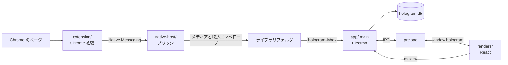

# Hologram のコードの歩き方

Hologram は Chrome 拡張、Native Messaging ホスト、Electron アプリの3つで動く。最初にコードを読むときは、機能別にディレクトリをたどる前に、保存と表示がどのプロセスを通るかを把握する。

この文書の構成は、入口・実行順・境界・ディレクトリを短く示す [VOICEVOX エディタのコードの歩き方](https://github.com/VOICEVOX/voicevox/blob/main/docs/%E3%82%B3%E3%83%BC%E3%83%89%E3%81%AE%E6%AD%A9%E3%81%8D%E6%96%B9.md) を手本にしている。Hologram 固有の設計と現在の詳細は [architecture.md](architecture.md)、採用理由は [decisions/](decisions/README.md) が正本である。

## まず全体を読む

保存は、拡張が投稿を読み、ホストが保存先フォルダへメディアと取込エンベロープを書き、アプリの main プロセスがそれを SQLite に取り込む順で進む。アプリが閉じていても、ホストは保存を受け付ける。アプリが次に起動するか、起動中なら取込フォルダの変更を検知した時に、表示へ反映される。

逆向きの経路は「この投稿は保存済みか」の問い合わせだけである。拡張は host に問い合わせ、host が保存済み索引を読んで答える。この問い合わせもアプリの起動を必要としない。

## 保存を追う

1. `extension/entrypoints/background.ts` が service worker の入口である。クリック保存、`Alt+S`、常駐コンテンツスクリプトからの要求を受け、タブをキャプチャして host へ送る。
2. `extension/entrypoints/resident.content.ts` はページに常駐する入口である。ドラッグ保存とタイムライン上の表示を担当する。
3. `extension/utils/extractor/index.ts` は対応サイトの登録簿である。サイト別モジュールは同じディレクトリにあり、URL・DOM・API の読み取りを `Extractor` 契約で提供する。
4. `native-host/protocol.mts` は拡張と host が共有する Native Messaging の契約である。保存要求と保存済み問い合わせを変えるときは、ここを先に読む。
5. `native-host/bridge.mts` は host の実行入口である。メディアを保存し、`native-host/inbox.mts` の関数を通じて `.hologram-inbox/` へエンベロープを書き込む。
6. `app/src/main/index.ts` は Electron の main プロセスの入口である。起動時とフォルダ監視時に `lib-db-inbox.ts` を呼び、エンベロープを SQLite の投稿・メディア・検索索引へ反映する。

取込キューは、拡張とアプリが同時にライブラリを扱っても保存を失わないための境界である。host から SQLite を直接更新しない。

## デスクトップアプリを追う

Electron は main、preload、renderer の3つの実行環境を分ける。

1. `app/src/main/index.ts` が main プロセスとして起動する。ウィンドウ、SQLite、ファイル、Native Messaging host の登録、IPC ハンドラを管理する。
2. `app/src/preload/index.ts` が renderer に `window.hologram` だけを公開する。renderer は Node や Electron API を直接読まない。
3. `app/src/renderer/index.html` が renderer の HTML 入口で、`app/src/renderer/src/app/index.tsx` を読み込む。
4. `app/src/renderer/src/app/root.tsx` が React root を1つ作り、`app/src/renderer/src/app/App.tsx` を描画する。
5. renderer は `window.hologram` を通して IPC を呼び、main が `app/src/main/ipc-*.ts` と `lib-*.ts` で処理する。

新しい UI は renderer に置く。ローカルファイル、SQLite、OS のダイアログ、外部 URL を開く処理は main に置き、preload に必要最小限の API を追加する。renderer から `ipcRenderer` や Node API を直接使わない。

## よく使う境界

| やりたいこと | 最初に読む場所 | 境界 |
| --- | --- | --- |
| 対応サイトを追加する | `extension/utils/extractor/types.ts` と `index.ts` | 1サイト1モジュール、登録簿が対応サイトの唯一の真実源 |
| 投稿を保存する経路を変える | `native-host/protocol.mts` と `bridge.mts` | 拡張と host の Native Messaging 契約 |
| 保存データを変える | `native-host/post-record.mts`、`inbox.mts`、`app/src/main/lib-db-*.ts` | host はエンベロープを書き、main が DB へ反映する |
| 画面からデータを読む／書く | `app/src/preload/index.ts` と対応する `app/src/main/ipc-*.ts` | `window.hologram` が renderer の唯一の特権 API |
| ライブラリのファイルを表示する | `app/src/main/library-files.ts` と `renderer-files.ts` | renderer は `asset://` 経由で読む |

## ディレクトリの役割

- `extension/` — WXT による Chrome 拡張。ページでの取得、API 由来のメタデータ取得、host への送信を担う。
- `native-host/` — Chrome が別プロセスとして起動する Native Messaging host。保存先フォルダへの書き込みと保存済み問い合わせを担う。
- `app/` — Electron アプリ。`src/main/` は特権処理、`src/preload/` は IPC の橋、`src/renderer/` は React UI。
- `docs/architecture.md` — 現在の構成と主要モジュールの詳細。
- `docs/decisions/` — 構成を選んだ理由を残す ADR。
- `e2e/` と `scripts/` — 実機経路・結合経路を確認するテストと開発用の導線。

## 次に読む文書

- [architecture.md](architecture.md) — 全体の構成と各層の詳細
- [build.md](build.md) — ビルド、起動、実機検証、配布
- [testing.md](testing.md) — テストの層と CI
- [glossary.md](glossary.md) — UI とコードで使う用語
