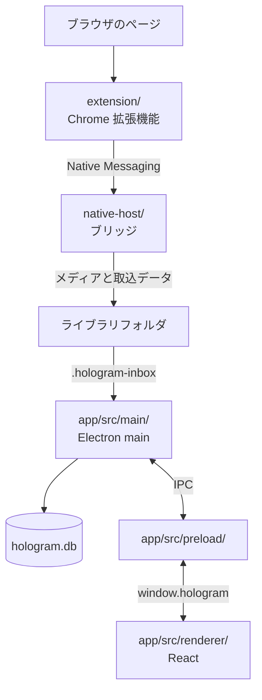

# Hologram のアーキテクチャ

Hologram は、Chrome 拡張機能、Native Messaging ホスト、Electron アプリで動きます。保存処理を拡張機能とアプリから分離し、アプリを閉じている間も投稿を受け付けられる構成です。

## データの流れ

1. 拡張機能が投稿の画面、URL、取得できるメタデータを読み取ります。
2. Native Messaging ホストがスクリーンショットや添付メディアをライブラリフォルダに保存し、取込キュー `.hologram-inbox/` にレコードを書き込みます。
3. Electron の main プロセスが取込キューを SQLite データベース `hologram.db` に反映します。
4. renderer が IPC を通じてデータベースの結果を受け取り、一覧、詳細、検索結果を表示します。

ライブラリは、メディア、データベース、取込キュー、バックアップ用の世代データを含む 1 つのフォルダです。フォルダ単位でコピー、バックアップ、切り替えができます。通常のライブラリでは、投稿ごとの JSON ファイルを保存しません。

拡張機能からアプリ側への逆方向の通信は、投稿が保存済みかを確認する問い合わせだけです。ホストが保存済み索引を参照するため、アプリが起動していなくても判定できます。

## コンポーネント

### `extension/`

WXT を使った Manifest V3 の Chrome 拡張機能です。

| 場所 | 役割 |
| --- | --- |
| `entrypoints/background.ts` | 保存要求を受け、タブのキャプチャとホストへの送信を行います。 |
| `entrypoints/resident.content.ts` | 投稿ページに常駐し、保存 UI、ドラッグ保存、保存済み表示を提供します。 |
| `utils/extractor/` | サイトごとの URL 解析、DOM 読み取り、API からのメタデータ取得を行います。`index.ts` で対応サイトを登録します。 |
| `utils/i18n.ts` と `public/_locales/` | ページ上の UI と拡張機能本体の翻訳を管理します。 |

対応サイトを追加するときは、`utils/extractor/` にモジュールを追加し、`index.ts` に登録します。サイトごとの処理はこのディレクトリに集め、保存や UI の共通処理に分散させません。

### `native-host/`

ブラウザから起動される Native Messaging ホストです。アプリとは別プロセスで動きます。

| 場所 | 役割 |
| --- | --- |
| `protocol.mts` | 拡張機能とホストが共有するリクエスト、応答、エラーの型を定義します。 |
| `bridge.mts` | メディアを保存し、取込キューへレコードを書き込みます。保存済み問い合わせにも応答します。 |
| `media-download.mts` | 添付メディアを安全にダウンロードします。サイズ、件数、接続先を制限します。 |
| `raw-payload.mts` | 取得した応答の原本を圧縮・検証してレコードに添付します。 |
| `post-key.mts` | 同じ投稿かどうかを判断するキーを作ります。 |

ホストは SQLite を直接操作しません。書き込みは取込キューまでにとどめ、データベースへの反映はアプリに任せます。

### `app/`

Electron アプリです。`src/main/`、`src/preload/`、`src/renderer/` の 3 層に分かれます。

| 場所 | 役割 |
| --- | --- |
| `src/main/index.ts` | 起動、ウィンドウ、取込キューの監視、IPC の登録を行います。 |
| `src/main/lib-db*.ts` | SQLite のスキーマ、取込、検索、書き込み、整合性確認を担当します。 |
| `src/main/ipc-*.ts` | renderer から呼び出す操作をチャンネルごとに実装します。 |
| `src/main/lib-library-safety.ts` | エクスポート通知、ローカル復元ポイント、整合性確認を担当します。 |
| `src/preload/index.ts` | renderer に `window.hologram` だけを公開します。 |
| `src/renderer/src/` | React による画面と、画面状態を扱うサービスを置きます。 |

renderer は Node.js、Electron、SQLite、ファイルシステムに直接触れません。特権が必要な操作は main に実装し、必要な API だけを preload 経由で公開します。

## 設計上の制約

- 拡張機能とホストの通信を変える場合は、`protocol.mts` を先に更新し、両側の型と処理をそろえてください。
- レコード形式や取込処理を変える場合は、ホスト、取込キュー、SQLite の変換処理を通して確認してください。
- renderer に API を追加する場合は、main、preload、renderer の 3 層を更新し、renderer に特権 API を直接渡さないでください。
- ライブラリ内のファイルを表示する経路では、`asset://` とライブラリパスの検証を通してください。

## 変更の入口

| 変更したいこと | 最初に読む場所 |
| --- | --- |
| 対応サイトを追加する | `extension/utils/extractor/types.ts` と `index.ts` |
| 保存要求や応答を変える | `native-host/protocol.mts` と `bridge.mts` |
| 保存するレコードを変える | `native-host/` の取込処理と `app/src/main/lib-db-*.ts` |
| 画面と main の通信を増やす | `app/src/preload/index.ts` と対応する `app/src/main/ipc-*.ts` |
| ライブラリ内のファイルを表示する | `app/src/main/library-files.ts` と `renderer-files.ts` |

起動と検証は [開発ガイド.md](開発ガイド.md)、テストは [テスト.md](テスト.md) を参照してください。
