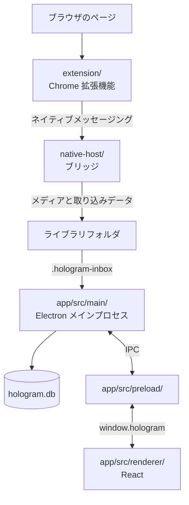

# Hologram のアーキテクチャ

Hologram は、Chrome 拡張機能、ネイティブメッセージングホスト、Electron アプリで動きます。保存処理を拡張機能とアプリから分離し、アプリを閉じている間も投稿を受け付けられる構成です。

## データの流れ

1. 拡張機能が投稿の URL、表示中の情報、取得できるメタデータと原本メディアの URL を読み取ります。
2. ネイティブメッセージングホストが投稿の画像や動画をライブラリフォルダに保存し、取り込みキュー `.hologram-inbox/` にレコードを書き込みます。
3. Electron のメインプロセスが取り込みキューを SQLite データベース `hologram.db` に反映します。
4. レンダラープロセスが IPC を通じてデータベースの結果を受け取り、一覧、詳細、検索結果を表示します。

ライブラリは、メディア、データベース、取り込みキュー、バックアップ用の世代データを含む 1 つのフォルダです。フォルダ単位でコピー、バックアップ、切り替えができます。通常のライブラリでは、投稿ごとの JSON ファイルを保存しません。

ライブラリの「ファイルをコピー」と Ctrl/Cmd+C は、単体ならそのファイル、スタックなら中の全ファイルをコピーします。複数選択では選択したカード全体を対象にし、重複するファイルは一度だけ渡します。右クリックしたカードが選択に含まれない場合は、そのカードだけを対象にします。「ファイルの場所を開く」も利用できます。

Windows では標準の FileDrop 形式、macOS では NSPasteboard のファイル URL を使います。元ファイルの存在をすべて確認してからクリップボードに書き込みます。ショートカットの保存済み設定を引き継ぐため、内部 ID `selection.copyImage` は維持します。

拡張機能からアプリ側への逆方向の通信は、投稿が保存済みかを確認する問い合わせだけです。ホストが保存済み索引を参照するため、アプリが起動していなくても判定できます。

## コンポーネント

### `extension/`

WXT を使った Manifest V3 の Chrome 拡張機能です。

| 場所 | 役割 |
| --- | --- |
| `entrypoints/background.ts` | 保存要求を受け、投稿情報を取得してホストへ送信します。 |
| `entrypoints/resident.content.ts` | 投稿ページに常駐し、ホバー保存、右クリック保存の情報取得、保存済み表示を提供します。 |
| `utils/extractor/` | サイトごとの URL 解析、DOM 読み取り、API からのメタデータ取得を行います。`index.ts` で対応サイトを登録します。 |
| `utils/i18n.ts` と `public/_locales/` | ページ上の UI と拡張機能本体の翻訳を管理します。 |

対応サイトを追加するときは、`utils/extractor/` にモジュールを追加し、`index.ts` に登録します。サイトごとの処理はこのディレクトリに集め、保存や UI の共通処理に分散させません。

### `native-host/`

ブラウザから起動されるネイティブメッセージングホストです。アプリとは別プロセスで動きます。

| 場所 | 役割 |
| --- | --- |
| `protocol.mts` | 拡張機能とホストが共有するリクエスト、応答、エラーの型を定義します。 |
| `bridge.mts` | メディアを保存し、取り込みキューへレコードを書き込みます。保存済み問い合わせにも応答します。 |
| `media-download.mts` | 添付メディアを安全にダウンロードします。サイズ、件数、接続先を制限します。 |
| `post-key.mts` | 同じ投稿かどうかを判断するキーを作ります。 |

ホストは SQLite を直接操作しません。書き込みは取り込みキューまでにとどめ、データベースへの反映はアプリに任せます。

### `app/`

Electron アプリです。`src/main/`、`src/preload/`、`src/renderer/` の 3 層に分かれます。

| 場所 | 役割 |
| --- | --- |
| `src/main/index.ts` | 起動、ウィンドウ、取り込みキューの監視、IPC の登録を行います。 |
| `src/main/lib-db*.ts` | SQLite のスキーマ、取り込み、検索、書き込み、整合性確認を担当します。 |
| `src/main/ipc-*.ts` | レンダラープロセスから呼び出す操作をチャンネルごとに実装します。 |
| `src/main/lib-library-safety.ts` | エクスポート通知、ローカル復元ポイント、整合性確認を担当します。 |
| `src/preload/index.ts` | レンダラープロセスに `window.hologram` だけを公開します。 |
| `src/renderer/src/` | React による画面と、画面状態を扱うサービスを置きます。 |

レンダラープロセスは Node.js、Electron、SQLite、ファイルシステムに直接触れません。特権が必要な操作はメインプロセスに実装し、必要な API だけをプリロードスクリプト経由で公開します。

## 設計上の制約

- 拡張機能とホストの通信を変える場合は、`protocol.mts` を先に更新し、両側の型と処理をそろえてください。
- レコード形式や取り込み処理を変える場合は、ホスト、取り込みキュー、SQLite の変換処理を通して確認してください。
- レンダラープロセスに API を追加する場合は、メインプロセス、プリロードスクリプト、レンダラープロセスの 3 層を更新し、レンダラープロセスに特権 API を直接渡さないでください。
- ライブラリ内のファイルを表示する経路では、`asset://` とライブラリパスの検証を通してください。

## 変更内容ごとの参照先

| 変更したいこと | 最初に読む場所 |
| --- | --- |
| 対応サイトを追加する | `extension/utils/extractor/types.ts` と `index.ts` |
| 保存要求や応答を変える | `native-host/protocol.mts` と `bridge.mts` |
| 保存するレコードを変える | `native-host/` の取り込み処理と `app/src/main/lib-db-*.ts` |
| 画面とメインプロセスの通信を増やす | `app/src/preload/index.ts` と対応する `app/src/main/ipc-*.ts` |
| ライブラリ内のファイルを表示する | `app/src/main/library-files.ts` と `renderer-files.ts` |

起動と検証は [開発ガイド.md](開発ガイド.md)、テストは [テスト.md](テスト.md) を参照してください。
