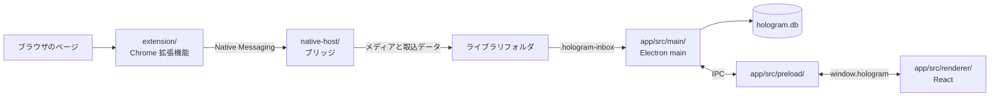

# Hologram のコードを読み始める

Hologram は、ブラウザ拡張機能、Native Messaging ホスト、デスクトップアプリで構成されます。最初に保存と表示の流れを把握すると、機能ごとの実装を追いやすくなります。

## 処理の流れ

拡張機能は投稿情報を取得し、ホストはメディアと取込データをライブラリフォルダに書き込みます。アプリは起動時と取込フォルダの変更時にデータを SQLite へ取り込みます。アプリが閉じていても保存でき、次にアプリを起動した時点で表示へ反映されます。

## 投稿の保存を追う

1. `extension/entrypoints/background.ts` は保存要求の入口です。クリック保存、`Alt+S`、コンテンツスクリプトからの要求を受け取ります。
2. `extension/entrypoints/resident.content.ts` はページ上の保存 UI、ドラッグ保存、保存済み表示を担当します。
3. `extension/utils/extractor/index.ts` は対応サイトを登録します。サイトごとのモジュールは URL、DOM、API から投稿情報を読み取ります。
4. `native-host/protocol.mts` は拡張機能とホストが共有するメッセージの型を定義します。
5. `native-host/bridge.mts` はメディアを保存し、取込キューへデータを書き込みます。
6. `app/src/main/index.ts` と `lib-db-inbox.ts` は取込キューを SQLite に反映します。

ホストは SQLite を直接更新しません。取込キューを介するため、拡張機能とアプリが同時にライブラリを扱っても保存処理が衝突しません。

## デスクトップアプリを追う

Electron は特権の異なる 3 つの実行環境に分かれます。

| 層 | 主な入口 | 役割 |
| --- | --- | --- |
| main | `app/src/main/index.ts` | ウィンドウ、ファイル、SQLite、IPC を管理します。 |
| preload | `app/src/preload/index.ts` | renderer に必要最小限の `window.hologram` API を公開します。 |
| renderer | `app/src/renderer/src/app/App.tsx` | React で画面を表示し、preload の API を呼び出します。 |

新しい UI は renderer に置いてください。ファイル操作、SQLite、OS のダイアログ、外部 URL を開く処理は main に置きます。renderer から Node.js や Electron の API を直接利用しません。

## 変更の入口

| 変更したいこと | 最初に読む場所 |
| --- | --- |
| 対応サイトを追加する | `extension/utils/extractor/types.ts` と `index.ts` |
| 保存要求や応答を変える | `native-host/protocol.mts` と `bridge.mts` |
| 保存するレコードを変える | `native-host/` の取込処理と `app/src/main/lib-db-*.ts` |
| 画面と main の通信を増やす | `app/src/preload/index.ts` と対応する `app/src/main/ipc-*.ts` |
| ライブラリ内のファイルを表示する | `app/src/main/library-files.ts` と `renderer-files.ts` |

詳細な構成は [全体構成.md](全体構成.md)、起動と検証は [ビルド.md](ビルド.md)、テストは [テスト.md](テスト.md) を参照してください。
